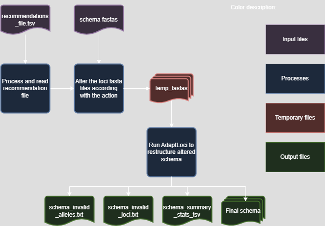

CreateSchemaStructure - Create a new schema based on 
=====================================================

Description
------------
The `CreateSchemaStructure` module is a module designed to facilitate the creation of a schema structure from a given schema or fasta files based on user recommendation file. This module parses command-line arguments to initiate the schema creation process, allowing users to efficiently generate a schema structure from a provided schema file. The generated schema structure is stored in the specified output directory.

Overview
--------
Process user recommendation file to create a schema structure from a given schema or fasta files.

Features
--------
- Creation of a schema structure from a given schema or fasta files.
- Support for parallel processing using multiple CPUs.
- Option to skip cleanup after running the module.

Dependencies
------------
- Python 3.9 or higher
- BLAST (`https://www.ncbi.nlm.nih.gov/books/NBK279690/ <https://www.ncbi.nlm.nih.gov/books/NBK279690/>`_)
- ChewBBACA (https://chewbbaca.readthedocs.io/en/latest/user/getting_started/installation.html or using bioconda)
- Install requirements using the following command:

.. code-block:: bash

    pip install -r requirements.txt

Usage
-----
The `CreateSchemaStructure` module can be used as follows:

.. code-block:: bash

    SR CreateSchemaStructure -s /path/to/schema -o /path/to/output -rf /path/to/recommendation.tsv -c 4 --nocleanup

Command-Line Arguments
----------------------

::

    -rf, --recommendations-file
        (Required) Path to the file containing the recommendations. Cannot be the annotated file, must only contain 2 columns with headers 'Locus' and 'Action'.

    -ff, --fastas-folder
        (Required) Path to the folder containing the FASTA files (Just Fastas or schema).

    -o, --output-directory
        (Required) Path to the directory where the output files will be saved.

    -c, --cpu
        (Optional) Number of CPU cores for multiprocessing.
        Default: 1

    -bsr, --blast-score-ratio
        (Optional) BSR value to consider alleles as the same locus.
        Default: 0.6

    -tt, --translation-table
        (Optional) Translation table to use for the CDS translation.
        Default: 11

    --nocleanup
        (Optional) Flag to indicate whether to skip cleanup after running the module.
        Default: False

    --debug
        (Optional) Flag to indicate whether to run the module in debug mode.
        Default: False

    --logger
        (Optional) Path to the logger file.
        Default: None

Algorithm Explanation
---------------------

The `CreateSchemaStructure` module uses the following algorithm to create a schema structure from a given schema or fasta files:

Make sure that before running this module the input file `recommendations` has been check and that  you agree with all the changes proposed. For example, a locus that has the action Join should not have the action Choice as well. One of these rows should be removed.

Since this module uses the AdaptLoci module to format the schema in the end, the schema created will conform with the structure of the schemas used by chewBBACA.

Outputs
-------
Folder and file structure for the output directory of the `CreateSchemaStructure` module is shown below. The output directory contains the following files and folders:

::

    OutputFolderName
    ├── schema
    │   ├── x.fasta
    │   ├── y.fasta
    │   ├── z.fasta
    │   ├── ...
    │   └── short
    │       ├── x_short.fasta
    │       ├── y_short.fasta
    │       ├── z_short.fasta
    │       └── ...
    ├── temp_fasta # --nocleanup
    │   ├── x.fasta
    │   ├── y.fasta
    │   ├── z.fasta
    │   └── ...
    ├── schema_invalid_alleles.txt # --nocleanup
    ├── schema_invalid_loci.txt # --nocleanup
    └── schema_summary_stats.tsv # --nocleanup

.. toctree::
    :maxdepth: 1
    
    CreateSchemaStructureOutputDescription

Report files description
------------------------

.. csv-table:: **schema_summary_stats.tsv**
   :header: "Gene", "Total_alleles", "Valid_alleles", "Number_representatives"
   :widths: 10, 10, 10, 10

   x, 11, 11, 1
   y, 1, 1, 1
   z, 11, 11, 1
   ...

Columns description:

::

    Gene: The locus ID of the query.
    Total_alleles: The number of alleles in the input schema.
    Valid_alleles: The number of alleles chosen to be in the final schema.
    Number_representatives: The number of alleles chosen to be the representatives of that loci.

Examples
--------

Here are some example commands to use the `CreateSchemaStructure` module:

.. code-block:: bash

    # Create schema structure from a given schema file
    SR CreateSchemaStructure -s /path/to/schema -o /path/to/output -rf /path/to/recommendation.tsv -c 4 --nocleanup

    # Create schema structure from a folder containing FASTA files
    SR CreateSchemaStructure -ff /path/to/fastas -o /path/to/output -rf /path/to/recommendation.tsv -c 4 --nocleanup

    # Create schema structure with custom BSR value and translation table
    SR CreateSchemaStructure -s /path/to/schema -o /path/to/output -rf /path/to/recommendation.tsv -c 4 --t 4 -bsr 0.8 --nocleanup

Troubleshooting
---------------

If you encounter issues while using the `CreateSchemaStructure` module, consider the following troubleshooting steps:

- Verify that the paths to the schema, output, and recommendations directories are correct.
- Check the output directory for any error logs or messages.
- Check if the dependecies versions are all compatible. 
- Increase the number of CPUs using the `-c` or `--cpu` option if the process is slow.