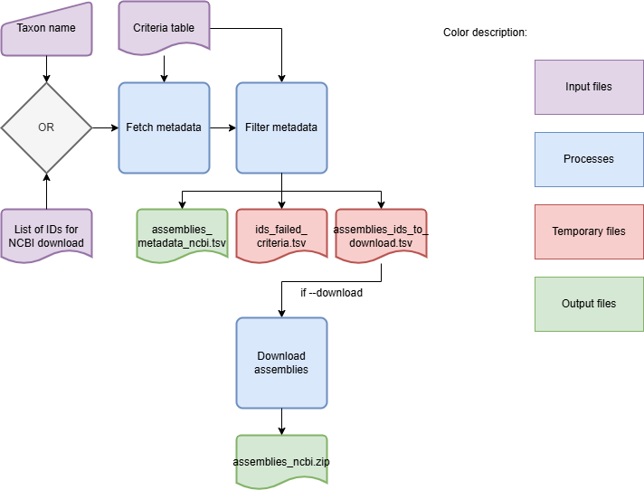
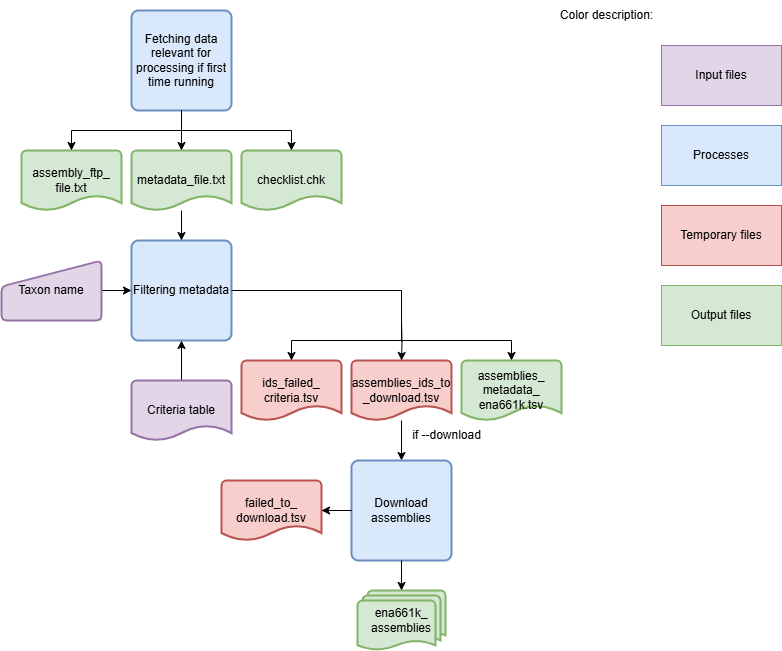
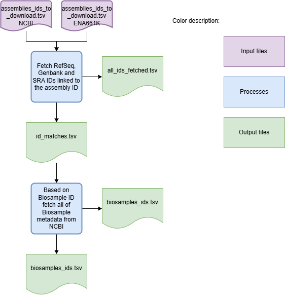

DownloadAssemblies - Download assemblies and their metadata from specified databases
====================================================================================

Description
-----------

The `DownloadAssemblies` module is a module designed to facilitate the download of genomic assemblies from specified databases. This module parses command-line arguments to initiate the download process, allowing users to efficiently retrieve assemblies from either the NCBI or ENA661 databases. The downloaded assemblies are stored in the specified output directory.

Overview
--------

The `DownloadAssemblies` module is designed to facilitate the download of genomic assemblies from specified databases.
It supports parallel downloads, filtering based on user-defined criteria, and the retrieval of associated metadata.

Features
--------

- Parallel downloading of assemblies using multiple threads.
- Support for downloading from NCBI and ENA661 databases.
- Filtering of assemblies based on criteria such as genome size, contig number, and assembly level.
- Retrieval of BioSample metadata for downloaded assemblies.
- Option to download assemblies based on taxon name or a provided IDs table.

Dependencies
------------

- Python 3.9 or higher
- NCBI datasets (`https://www.ncbi.nlm.nih.gov/datasets/ <https://www.ncbi.nlm.nih.gov/datasets/>`_)
- Install requirements using the following command:

.. code-block:: bash

    pip install -r requirements.txt

Usage
-----

The `DownloadAssemblies` module can be used as follows:

.. code-block:: bash

    SR DownloadAssemblies -f /path/to/input_file_with_taxon -db NCBI ENA661K -o /path/to/output -e email@example -th 4 -fm --download

Command-Line Arguments
----------------------

::

    -db, --database
        (Required) Databases from which assemblies will be downloaded.
        Choices: NCBI, ENA661K

    -o, --output-directory
        (Required) Path to the output directory.

    -e, --email
        (Required) Email provided to Entrez.

    -f, --input-file
        (Required) TSV file containing filtering parameters and either a path to a list of accession numbers (only fo NCBI) or the taxon applied before assembly download.

    -th, --threads
        (Optional) Number of threads used for download. You should provide an API key to perform more requests through Entrez.
        Default: 1

    -r, --retry
        (Optional) Maximum number of retries when a download or request fails.
        Default: 7

    -k, --api-key
        (Optional) Personal API key provided to the NCBI. If not set, only 3 requests per second are allowed through Entrez. With a valid API key the limit increases to 10 requests per second.

    -fm, --fetch-metadata
        (Optional) If provided, the process downloads metadata for the assemblies.
        Default: False

    --download
        (Optional) If the assemblies that passed the filtering criteria should be downloaded.

    --debug
        (Optional) Flag to indicate whether to run the module in debug mode.
        Default: False

    --logger
        (Optional) Path to the logger file.
        Default: None

Algorithm Explanation
---------------------

The `DownloadAssemblies` Workflow is shown in the flowchart below:

Workflow for downloading assemblies from NCBI:

Workflow for downloading assemblies from ENA661K:

Workflow for downloading metadata:

Filtering criteria example
--------------------------
Filtering criteria file should be a TSV file with the following columns:
 
* taxon: Scientific name of the taxon (NCBI, ENA661K)
* input_table: Text file with a list of accession numbers for the NCBI Assembly database (NCBI)
* abundance: Abundance of the taxon in the environment (ENA661K) (0-1)
* genome_size: Genome size in Mbp (NCBI, ENA661K) (>1)
* size_threshold: Threshold for genome size in Mbp (NCBI, ENA661K) (0-1)
* max_contig_number: Maximum number of contigs in the assembly (NCBI, ENA661K) (>1)
* known_st: Known sequence type (ENA661K) (True, False, None)
* any_quality: Any quality (ENA661K) (True, False, None)
* ST_list_path: Path to the sequence type list (ENA661K) (path, None)
* assembly_level: Assembly level (NCBI, ENA661K) (chromosome,complete,contig,scaffold)
* reference: If reference genome (NCBI) (True, False, None)
* assembly_source: Assembly source (NCBI) (all, refseq, genbank)
* file_to_include: files to include (NCBI) (genome, rna, protein, cds, gff3, gtf, gbff, seq-report, none)
* verify_status: Verify status (NCBI) (True, False, None)
* exclude_atypical: Exclude atypical (NCBI) (True, False, None)

The filtering criteria file is only applicable to certain databases e.g ST_list_path to ENA661K since it is known at the ENA661K table.
When None or empty value is provided, the filtering criteria will not be applied.
The file can only contain either the taxon or input_table row, not both.

Outputs
-------
Folder and file structure for the output directory of the `DownloadAssemblies` module is shown below. The output directory contains the following files and folders:

::

    OutputFolderName
    ├── assemblies_ncbi.zip # -db NCBI --download
    ├── ena661k_assemblies # -db ENA661 --download
    │   ├── x.contigs.fa.gz
    │   ├── y.contigs.fa.gz
    │   ├── z.contigs.fa.gz
    │   └── ...
    ├── metadata_all # -fm
    │   ├── biosamples_ids.tsv
    │   ├── id_matches.tsv
    │   ├── all_ids_fetched.tsv
    │   └── metadata_biosamples.tsv
    ├── assemblies_metadata_ena661k.tsv # -db ENA661k
    ├── assemblies_metadata_ncbi.tsv # -db NCBI
    ├── metadata_ncbi # -db NCBI --nocleanup
    │   ├── assemblies_ids_to_download.tsv
    │   └── ids_failed_criteria.tsv
    └── metadata_ena661k # -db ENA661k --nocleanup
        ├── assemblies_ids_to_download.tsv
        ├── failed_to_download.tsv
        └── id_failed_criteria.tsv

.. toctree::
   :maxdepth: 1

   DownloadAssembliesOutputExplanation

Examples
--------

Here are some example commands to use the `DownloadAssemblies` module:

.. code-block:: bash

    # Download assemblies from NCBI for a specific taxon
    SR DownloadAssemblies -f /path/to/input_file_with_taxon -db NCBI -o /path/to/output -e email@example.com -th 4 --download

    # Download assemblies from NCBI using an IDs table
    SR DownloadAssemblies -f /path/to/input_file_with_id_table -db NCBI -o /path/to/output -e email@example.com -th 4 --download 

    # Download assemblies from both NCBI and ENA661K with filtering criteria
    SR DownloadAssemblies -t "Streptococcus pyogenes" -db NCBI ENA661K -o /path/to/output -e email@example.com -th 4 -fm --download

Troubleshooting
---------------

If you encounter issues while using the `DownloadAssemblies` module, consider the following troubleshooting steps:

- Ensure that you have a stable internet connection.
- Verify that your email and API key (if provided) are correct.
- Check the output directory for any error logs or messages.
- Check if the versions of the Dependencies are compatible with the environment.
- Increase the number of retries using the `-r` or `--retry` option if downloads are failing.