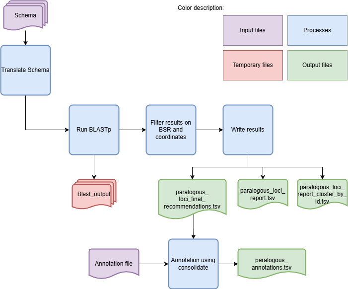

IdentifyParalogousLoci - Identify paralogous loci in a schema
=============================================================

Description
-----------

The `IdentifyParalogousLoci` module is a comprehensive tool designed to identify paralogous loci within a cg/wgMLST schema. This module is essential for researchers and bioinformaticians who need to detect and analyze paralogous loci, which are genes that have evolved by duplication within a genome and may have similar but not identical functions.

Features
--------

- Identification of paralogous loci in a schema.
- Configurable parameters for the identification process.
- Support for parallel processing using multiple CPUs.
- Option to skip cleanup after running the module.

Dependencies
------------

- Python 3.9 or higher
- BLAST (`https://www.ncbi.nlm.nih.gov/books/NBK279690/ <https://www.ncbi.nlm.nih.gov/books/NBK279690/>`_)
- Install requirements using the following command:

.. code-block:: bash

    pip install -r requirements.txt

Usage
-----

The `IdentifyParalogousLoci` module can be used as follows:

.. code-block:: bash

    SR IdentifyParalogousLoci -s /path/to/schema -o /path/to/output -c 4 -b 0.6 -tt 11 -st 0.2 -pm alleles_vs_alleles --nocleanup

Command-Line Arguments
----------------------
::

    -s, --schema-directory
        (Required) Folder that contains the schema to identify paralogous loci.

    -o, --output-directory
        (Required) Path to the directory to which files will be stored.

    -ann, --annotations
        (Optional) Path to the tsv file with the schema annotations to be added to the recommendations file.
        This file needs to have one column with loci with the same IDs as the ones in the schema.

    -c, --cpu
        (Optional) Number of CPUs to run BLAST instances.
        Default: 1

    -b, --bsr
        (Optional) BSR value to consider alleles as the same locus.
        Default: 0.6

    -tt, --translation-table
        (Optional) Translation table to use for the CDS translation.
        Default: 11

    -st, --size-threshold
        (Optional) Size threshold to consider two paralogous loci as similar.
        Default: 0.2

    -pm, --processing-mode
        (Optional) Mode to run the module.
        Choices: reps_vs_reps, reps_vs_alleles, alleles_vs_alleles, alleles_vs_reps.
        Default: alleles_vs_alleles

    --nocleanup
        (Optional) Flag to indicate whether to skip cleanup after running the module.

    --debug
        (Optional) Flag to indicate whether to run the module in debug mode.
        Default: False

    --logger
        (Optional) Path to the logger file.
        Default: None

Algorithm Explanation
---------------------

Algorithm to identify paralogous loci in a schema is shown below:

The column from the annotation file that has the highest number of matches between loci IDs with the schema fasta IDs will be chosen as the one to merge.

Outputs
-------
Folder and file structure for the output directory of the `IdentifyParalogousLoci` module is shown below. The output directory contains the following files and folders:

::

    OutputFolderName
    ├── Blast # --nocleanup
    │   ├── Blast_db_prot
    │   │   ├── Blast_db_protein.pdb
    │   │   ├── Blast_db_protein.phr
    │   │   ├── Blast_db_protein.pin
    │   │   ├── Blast_db_protein.pog
    │   │   ├── Blast_db_protein.pos
    │   │   ├── Blast_db_protein.pot
    │   │   ├── Blast_db_protein.psq
    │   │   ├── Blast_db_protein.ptf
    │   │   └── Blast_db_protein.pto
    │   ├── Blast_output
    │   │   ├── blast_results_x.tsv
    │   │   ├── blast_results_y.tsv
    │   │   ├── blast_results_z.tsv
    │   │   └── ...
    │   ├── master_file.fasta
    │   ├── self_score_folder
    │   │   ├── blast_results_x.tsv
    │   │   ├── blast_results_y.tsv
    │   │   ├── blast_results_z.tsv
    │   │   └── ...
    │   └── Translation
    │       ├── x_translation.fasta
    │       ├── y_translation.fasta
    │       ├── z_translation.fasta
    │       └── ...
    ├── paralogous_annotations.tsv #-ann
    ├── paralogous_loci_report.tsv
    ├── paralogous_loci_report_cluster_by_id.tsv
    └── paralogous_loci_final_recommendations.tsv

.. toctree::
   :maxdepth: 1

   IdentifyParalogousLociOutputExplanation

Report files description
------------------------

.. csv-table:: **paralogous_loci_report.tsv**
   :header: "Query_loci_id", "Subject_loci_id", "BSR", "if_loci_intersect", "if_close_distance", "Loci_min_allele_size", "Loci_max_allele_size", "Loci_mode_allele_size", "Loci_mean_allele_size"
   :widths: 15, 15, 10, 10, 10, 20, 20, 20, 20

   x, a, 0.7360028348688873, False, False, 416.0|1349.0, 544.0|1645.0, 515.0|1628.0, 476.75|1615.125
   x, b, 0.6146651702207258, False, True, 416.0|599.0, 544.0|738.0, 515.0|738.0, 476.75|720.625
   x, c, 0.6523642732049036, True, True, 416.0|466.0, 544.0|547.0, 515.0|547.0, 476.75|512.5714285714286
   ...

columns description:

::

    Query_loci_id: The locus ID of the query.
    Subject_loci_id: The locus ID of the subject.
    BSR: The BSR value between the query and subject loci.
    if_loci_intersect: If the loci intersect.
    if_close_distance: If the loci are close in distance.
    Loci_min_allele_size: The minimum allele size of the loci, query and subject values are separated by '|'.
    Loci_max_allele_size: The maximum allele size of the loci, query and subject values are separated by '|'.
    Loci_mode_allele_size: The mode allele size of the loci, query and subject values are separated by '|'.
    Loci_mean_allele_size: The mean allele size of the loci, query and subject values are separated by '|'.

.. csv-table:: **paralogous_loci_report_cluster_by_id.tsv**
   :header: "Joined_loci_id", "Clustered_loci_ids"
   :widths: 10, 20

   x, "x,a,b,c"
   y, "y,d,e,f"
   z, "z,g,h"
   ...

columns description:
::

    Joined_loci_id: First Locus on the cluster.
    Clustered_loci_ids: List of all the loci that should be joined together.

.. csv-table:: **paralogous_loci_final_recommendations.tsv**
   :header: "Locus", "Action"
   :widths: 10, 20

   x, Join
   y, Join
   z, Join
   #
   a, Join
   b, Join
   #
   ...

columns description:

::

    Locus: Name of the locus to be joined in the clustered.
    Action: Action to be taken, always 'Join' in this module.
    #: Separates each cluster of loci.

This file can be used as the input of the `CreateSchemaStructure`. The annotated version of this file can not.

.. csv-table:: **paralogous_annotations.tsv**
   :header: "Loci", "Action", "Locus_annotation", "Annotation"
   :widths: 10, 15, 10, 20

   x, Join, x, annotation
   y, Join, y, annotation
   z, Join, z, annotation
   #
   a, Join, a, annotation
   b, Join, b, annotation
   #
   ...

columns description:

::

    Loci: Name of the locus to be joined in the clustered.
    Action: Action to be taken, always 'Join' in this module.
    Locus_annotation: Name of the Locus in the annotation file (should be the same as Locus).
    Annotation: Column with annotation from the annotation file.
        (The name and numer of columns with annotations will depend on the file with the annotation, follows the structure of the output of the consolidate module).
    #: Separates each cluster of loci.

Examples
--------

Here are some example commands to use the `IdentifyParalogousLoci` module:

.. code-block:: bash

    # Identify paralogous loci using default parameters
    SR IdentifyParalogousLoci -s /path/to/schema -o /path/to/output

    # Identify paralogous loci with custom parameters
    SR IdentifyParalogousLoci -s /path/to/schema -o /path/to/output -ann /path/to/annotation/file -c 4 -b 0.7 -tt 4 -st 0.3 -pm reps_vs_reps --nocleanup

Troubleshooting
---------------

If you encounter issues while using the `IdentifyParalogousLoci` module, consider the following troubleshooting steps:

- Verify that the paths to the schema and output directories are correct.
- Check the output directory for any error logs or messages.
- Increase the number of CPUs using the `-c` or `--cpu` option if the process is slow.
