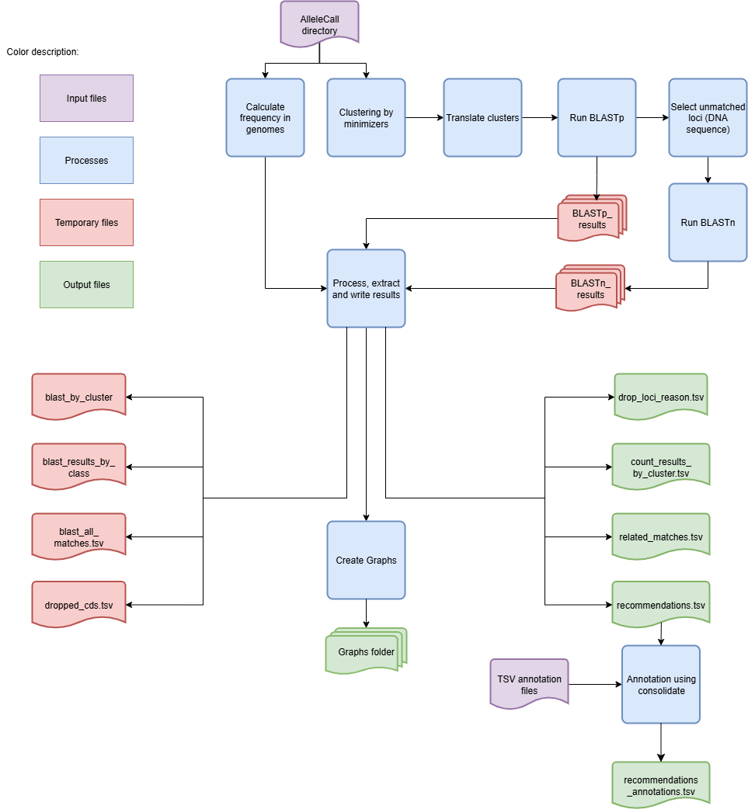
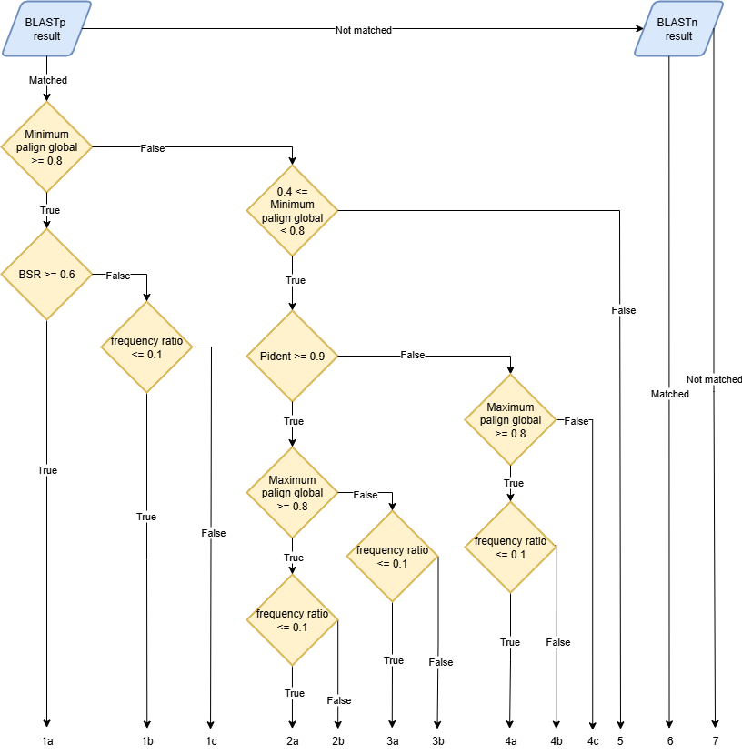

IdentifySpuriousGenes - Identify spurious genes in a schema
===========================================================

Description
-----------

The `IdentifySpuriousGenes` module identifies spurious genes in a schema, providing a set of recommendations that can be used to refine schemas and improve their quality. The module takes unclassified CDSs or schema loci and matches them against each other, providing a classification for each match. Based on the classifications, the best class is chosen to represent the relationship between the two loci. Using these relationships, the user can select the appropriate loci or unclassified CDS group to be included/joined in the final schema and remove those that are spurious.

Features
--------

- Identification of spurious genes in a schema.
- Optional addition of annotation data to the recommendations.
- Configurable parameters for the identification process.
- Support for parallel processing using multiple CPUs.
- Option to skip intermediate file cleanup after running the module.

Dependencies
------------

- BLAST (manual `here <https://www.ncbi.nlm.nih.gov/books/NBK279690/>`_)
- chewBBACA 3.3.10 or higher (`chewBBACA's installation instructions <https://chewbbaca.readthedocs.io/en/latest/user/getting_started/installation.html>`_).

Usage
-----

The `IdentifySpuriousGenes` module can be used as follows:

.. code-block:: bash

    SR IdentifySpuriousGenes -s /path/to/schema -o /path/to/output -a /path/to/allelecall -tt 11 -b 0.6 -m schema -pm reps_vs_alleles -c 4 --nocleanup

Command-Line Arguments
----------------------

::

    -s, --schema-directory
        (Required) Path to the created schema directory.

    -o, --output-directory
        (Required) Path to the directory to which files will be stored.

    -a, --allelecall-directory
        (Required) Path to the directory that contains allele call directory from chewBBACA that was run with --no-cleanup and --output-unclassified.

    -ann, --annotations
        (Optional) Path to the tsv file with the schema annotations.
        This file needs to have one column with loci with the same IDs as the ones in the schema.

    -at, --alignment-ratio-threshold
        (Optional) Threshold value for alignment used to identify spurious CDS (float: 0-1).
        Default: 0.9

    -pt, --pident-threshold
        (Optional) Threshold value for pident values used to identify spurious CDS (int 0-100).
        Default: 90

    -cs, --clustering-sim
        (Optional) Similarity value for kmers representatives (float: 0-1).
        Default: 0.9

    -cc, --clustering-cov
        (Optional) Coverage value for kmers representatives (float: 0-1).
        Default: 0.9

    -gp, --genome-presence
        (Optional) The minimum number of genomes specific cluster of CDS must be present in order to be considered.

    -as, --absolute-size
        (Optional) Size of the CDS to consider processing.
        Default: 201

    -tt, --translation-table
        (Optional) Translation table to use for the CDS translation.
        Default: 11

    -b, --bsr
        (Optional) BSR value to consider alleles as the same locus.
        Default: 0.6

    -sr, --size-ratio
        (Optional) Size ratio to consider alleles as the same locus.
        Default: 0.8

    -m, --run-mode
        (Optional) Run mode for identifying spurious loci.
        Choices: unclassified_cds, schema, schema_vs_schema
        Default: schema

    -c, --cpu
        (Optional) Number of CPUs to run BLAST instances.
        Default: 1

    --nocleanup
        (Optional) Flag to indicate whether to skip cleanup after running the module.

    --debug
        (Optional) Flag to indicate whether to run the module in debug mode.
        Default: False

    --logger
        (Optional) Path to the logger file.
        Default: None

.. Note::
    Always verify it the translation table (argument -tt) being used is the correct one for the species.

The argument passed to the `--allelecall-directory` parameter must be the folder created by chewBBACA's AlleleCall module while providing the `--no-cleanup` and `--output-unclassified` arguments. Without these arguments the files needed to run the `IdentifySpuriousGenes` module will not be created. The options `--schema-directory` and `--allelecall-directory` must have two paths each if the `run_mode` is `schema_vs_schema`, one path per schema corresponding to each schema's AlleleCall directory.

Algorithm Explanation
---------------------

Algorithm to indentify spurious loci based on schema inputs for run modes schema and schema_vs_schema:
^^^^^^^^^^^^^^^^^^^^^^^^^^^^^^^^^^^^^^^^^^^^^^^^^^^^^^^^^^^^^^^^^^^^^^^^^^^^^^^^^^^^^^^^^^^^^^^^^^^^^^

.. image:: source/IdentifySpuriousGenes_schema.png
   :alt: Algorithm to identify spurious loci
   :width: 80%
   :align: center

The module will only use the representative alleles of the schema. Working with all the alleles is not an option as it would be too computationally heavy and provide minimal benefits. The classification algorithm has two main steps. The first step uses BLASTp to align the translated alleles and filters the results based on BSR and percent identity thresholds. In the second step, the loci without matches are aligned with BLASTn to identify similar DNA sequences whose translation is not detected as similar by BLASTp due to frameshifts. This two-step process identifies highly similar alleles, as well as matches between partial alleles, pseudogenes, and frameshifted alleles. This enables the accurate identification of potential spurious loci in the schema.

.. Note::
	BLAST limits the number of hits reported per cluster. Schema Refinery uses a value for this limit aimed at computational efficiency. Nonetheless, it can happen that not all matches within a group are reported. This can happen if a group has a great number of highly similar alleles, such as when it includes many alleles from the same locus, (e.g. several thousand), potentially resulting in a match between every single allele in the group (in which case the number of matches is equal to the square of the number of alleles in the group). To minimize issues caused by hitting this limit, we exclude the alleles for the same locus that is being used as query from the database search space, eliminating the possibility of reporting matches between alleles of the same locus, a case in which the limit of reported alignments could quickly reach the limit.

The BLAST output has the following format:
::
	qseqid sseqid qlen slen qstart qend sstart send length score gaps pident

Algorithm to identify new loci based on the CDSs not classified by chewBBACA
^^^^^^^^^^^^^^^^^^^^^^^^^^^^^^^^^^^^^^^^^^^^^^^^^^^^^^^^^^^^^^^^^^^^^^^^^^^^

This execution mode has an extra step after computing the allele frequencies. It clusters the unclassified CDSs based on similarity and sequence size variation thresholds to identify groups of unclassified CDSs that are likely to represent the same locus. The ID of the representative CDS for each cluster is used as the ID for all the CDSs in that cluster.

The BLAST results are parsed and given a class based on the following rules:
^^^^^^^^^^^^^^^^^^^^^^^^^^^^^^^^^^^^^^^^^^^^^^^^^^^^^^^^^^^^^^^^^^^^^^^^^^^^

---------------------------------------------------------------------------------

A locus can be assigned multiple classes depending on the alignment that is considered to determine its classification. For that reason, it is important to evaluate the results in a way that allows to select the best class for each locus. To ensure this, we have established the following class precedence order, which is used to select the best class for each locus:

1a, 1b, 2a, 3a, 2b, 1c, 3b, 4a, 4b, 4c, 5, 6, 7

Depending on the classification, each locus will have a specific action recommended:
::
    Join: 1a
    Choice: 1c, 2b, 3b, 4b, 6
    Drop: 1b, 2a, 3a, 4a
    Add: 4c, 5, 7

- The **Choice** recommendation indicates that the user has to decide if the locus should just be added as is ("Add"), dropped ("Drop") or joined to the cluster it is in ("Join"). The remaining loci are all assigned the "Add" action, indicating that they should be included in the schema without any changes.

All matches found with BLASTn will be classified as 6 which corresponds to the action "Choice". As it is not possible to compute the BSR from BLASTn results, those cases can not be classified as "Drop" or "Add". However, for this file to be used in the `CreateSchemaStructure` module these "Choice" actions have to be changed into one of the other actions. This implies that the user must review and annotate the recommendations and choose the action it considers best.

.. Important::
	The recommendations in the final output file may not match the recommendations in the intermediate files. For example, a locus that was part of a 1a cluster can be marked as "Drop" if it does not pass the frequency threshold.

The annotation option uses the `consolidate` mode from the `SchemaAnnoation` module, so the input format should comform with the rules set in the :doc:`SchemaAnnotation documentation </SchemaRefinery/Modules/SchemaAnnotation>`.

Outputs
-------
The directory structure of the output directory created by the `IdentifySpuriousGenes` module is shown below.

.. Important::
	Since it is possible to choose between two run modes, the output directory structure will vary based on the selected mode.

When the `--run-mode` is set to `schema` or `schema_vs_schema`:

::

    OutputFolderName
    ├── 1_schema_processing # --nocleanup
    │   ├── master_nucleotide.fasta
    │   ├── schema
    │   │   ├── .genes_list
    │   │   ├── .schema_config
    │   │   ├── loci_x.fasta
    │   │   ├── new_loci_y.fasta
    │   │   ├── ...
    │   │   └── short
    │   │       ├── loci_x.fasta
    │   │       ├── new_loci_y.fasta
    │   │       └── ...
    │   └── schema_translation_folder
    │       ├── loci_x.fasta
    │       ├── new_loci_y.fasta
    │       └── ...
    ├── 2_BLAST_processing # --nocleanup
    │   ├── 1_BLASTn_processing
    │   │   ├── blast_db_nucl
    │   │   │   ├── Blast_db_nucleotide.ndb
    │   │   │   ├── Blast_db_nucleotide.nhr
    │   │   │   ├── Blast_db_nucleotide.nin
    │   │   │   ├── Blast_db_nucleotide.nog
    │   │   │   ├── Blast_db_nucleotide.nsd
    │   │   │   ├── Blast_db_nucleotide.nsi
    │   │   │   ├── Blast_db_nucleotide.nsq
    │   │   │   ├── Blast_db_nucleotide.ntf
    │   │   │   └── Blast_db_nucleotide.nto
    │   │   └── BLASTn_results
    │   │       ├── blast_results_x.tsv
    │   │       ├── blast_results_y.tsv
    │   │       └── ...
    │   └── 2_BLASTp_processing
    │       ├── blastn_results_matches_translations
    │       │   │   └── cluster_rep_translation
    │       │   │       ├── cluster_rep_translation_x.fasta
    │       │   │       ├── cluster_rep_translation_y.fasta
    │       │   │       └── ...
    │       │   ├── cluster_matches_translation_x.tsv
    │       │   ├── cluster_matches_translation_y.tsv
    │       │   └── ...
    │       ├── BLASTp_results
    │       │   ├── blast_results_x.tsv
    │       │   ├── blast_results_y.tsv
    │       │   └── ...
    │       └── BLASTp_results_self_score_results
    │           ├── blast_results_x.tsv
    │           ├── blast_results_y.tsv
    │           └── ...
    ├── 3_processing_results # --nocleanup
    │   └── blast_results
    │       ├── blast_all_matches.tsv
    │       ├── blast_by_cluster
    │       │   ├── blast_joined_cluster_x.tsv
    │       │   ├── blast_retained_y.tsv
    │       │   └── ...
    │       └── blast_results_by_class
    │           ├── class_1a.tsv
    │           ├── class_2a.tsv
    │           └── ...
    ├── count_results_by_cluster.tsv
    ├── drop_loci_reason.tsv
    ├── recommendations.tsv
    ├── recommendations_annotations.tsv # -ann
    └── related_matches.tsv

When it is set to `unclassified_cds`:

::

    OutputFolderName
    ├── 1_CDS_processing # --nocleanup
    │   ├── CDS_not_found.fasta
    │   └── CDS_not_found_translation.fasta
    ├── 2_BLAST_processing # --nocleanup
    │   ├── 1_BLASTn_processing
    │   │   ├── cluster_representatives_fastas_dna
    │   │   │   ├── cluster_rep_x.fasta
    │   │   │   ├── cluster_rep_y.fasta
    │   │   │   └── ...
    │   │   ├── Blast_db_nucl
    │   │   │   ├── Blast_db_nucleotide.ndb
    │   │   │   ├── Blast_db_nucleotide.nhr
    │   │   │   ├── Blast_db_nucleotide.nin
    │   │   │   ├── Blast_db_nucleotide.nog
    │   │   │   ├── Blast_db_nucleotide.nsd
    │   │   │   ├── Blast_db_nucleotide.nsi
    │   │   │   ├── Blast_db_nucleotide.nsq
    │   │   │   ├── Blast_db_nucleotide.ntf
    │   │   │   └── Blast_db_nucleotide.nto
    │   │   └── BLASTn_results
    │   │       ├── blast_results_x.tsv
    │   │       ├── blast_results_y.tsv
    │   │       └── ...
    │   └── 2_BLASTp_processing
    │       ├── blastn_results_matches_translations
    │       │   │   └── cluster_rep_translation
    │       │   │       ├── cluster_rep_translation_x.fasta
    │       │   │       ├── cluster_rep_translation_y.fasta
    │       │   │       └── ...
    │       │   ├── cluster_matches_translation_x.tsv
    │       │   ├── cluster_matches_translation_y.tsv
    │       │   └── ...
    │       ├── BLASTp_results
    │       │   ├── blast_results_x.tsv
    │       │   ├── blast_results_y.tsv
    │       │   └── ...
    │       └── BLASTp_results_self_score_results
    │           ├── blast_results_x.tsv
    │           ├── blast_results_y.tsv
    │           └── ...
    ├── 3_processing_results # --nocleanup
    │   ├── blast_results
    │   │   ├── blast_all_matches.tsv
    │   │   ├── blast_by_cluster
    │   |   │   ├── blast_joined_cluster_x.tsv
    │   |   │   ├── blast_retained_y.tsv
    │   │   │   └── ...
    │   │   └── blast_results_by_class
    │   │       ├── class_1a.tsv
    │   │       ├── class_2a.tsv
    │   │       └── ...
    │   ├── cds_id_changes.tsv
    │   ├── dropped_cds.tsv
    │   └── Graph_folder
    │       ├── All_of_CDS_graphs.html
    │       ├── graphs_class_1a.html
    │       └── ...
    ├── count_results_by_cluster.tsv
    ├── drop_loci_reason.tsv
    ├── recommendations.tsv
    ├── recommendations_annotations.tsv # -ann
    ├── related_matches.tsv
    └── temp_fastas
        ├── x.fasta
        ├── y.fasta
        └── ...
  

.. toctree::
   :maxdepth: 1

   IdentifySpuriousGenesOutputDescription

Report files description
------------------------

.. csv-table:: **count_results_by_cluster.tsv**
    :header: "Query", "Subject", "1a", "1b", "2a", "3a", "2b", "1c", "3b", "4a", "4b", "4c", "5", "Representatives_count", "Alelles_count", "Frequency_in_genomes_query", "Frequency_in_genomes_subject"
    :widths: 15, 15, 20, 5, 5, 5, 5, 15, 5, 5, 5, 5, 5, 20, 20, 25, 25

    x, y, 378|1024|-|1024, -, -, -, -, 646|1024|1024|1024, -, -, -, -, -, 16|64, 16|64, 223, 133
    x, z, -, -, -, -, -, 128|128|128|128, -, -, -, -, -, 16|8, 16|8, 223, 99
    x, w, 6|224|1|224, -, -, -, -, 218|224|223|224, -, -, -, -, -, 16|14, 16|14, 223, 221
    ...

Columns description:
::

    Query: The query locus.
    Subject: The subject locus.
    1a-5: The count of the loci in the cluster, interpret the values as this, for x query and y subject class 1a '378|1024|-|1024', x has 378 matches out of 1024 to y that are class 1a and while y has no matches '-' out of 1024 to x.
    alleles_used_to_blast_count: The count of alleles used to blast.
    alleles_blasted_against_count: The count of alleles blasted against.
    Frequency_in_genomes_query: The frequency of the query locus in genomes.
    Frequency_in_genomes_subject: The frequency of the subject locus in genomes.

.. csv-table:: **drop_loci_reason.tsv**
    :header: "Possible_new_loci_ID", "Drop_Reason"
    :widths: 30, 60

    x, Dropped_due_to_smaller_genome_presence_than_matched_cluster
    y, Dropped_due_to_smaller_genome_presence_than_matched_cluster
    z, Dropped_due_to_smaller_genome_presence_than_matched_cluster
    ...

Columns description
::

    Possible_new_loci_ID: The identifier for the possible new locus.
    Drop_Reason: The reason for dropping the locus.

.. csv-table:: **recommendations.tsv**
    :header: "Locus", "Action", "Class"
    :widths: 15, 20, 5

    x, Join, 1a
    y, Join, 1a
    z, Choice, 3b
    #
    a, Choice, 1c
    b, Choice, 1c
    #
    c, Drop, 1b
    #
    ...

This is the main output file and can be used as the input for the `CreateSchemaStructure` module. It is adviced to add loci annotations to this file using the argument `--annotations` to more easily review and confirm the resulting clusters and actions.

.. Note::
	Some clusters are singletons, including only one locus with the action "Drop". These cases occur when a locus had a match with other loci but due to its low frequency it is recommended to drop the locus. The loci it had matches with will be assigned the "Add" action. To check the full cluster relationships consult the `related_matches.tsv` file.

Columns description:
::

    Locus: Name of the locus to be joined in the clustered.
    Action: Action to be taken (Join, Choice, Drop or Add).
    Class: Class that the loci was classified with.
    #: Separates each cluster of loci.

.. Note::
    Subgroups can be created out of bigger clusters by adding a new line with only "#". It can be useful for making analysing big clusters easier or to join only specific loci in a group.

.. Note:: 
    Before passing the recommendations file to the `CreateSchemaStructure` module, make sure there are no "Choice" actions. Users should change "Choice" actions into one of the other available options as they review the recommendations.

.. csv-table:: **recommendations_annotations.tsv**
   :header: "Loci", "Action", "Locus_annotation", "Annotation"
   :widths: 15, 20, 15, 40

   x, Join, x, annotation
   y, Join, y, annotation
   z, Choice, z, annotation
   #
   a, Choice, a, annotation
   b, Choice, b, annotation
   #
   c, Drop, c, annotation
   #
   ...

Columns description:

::

    Loci: Name of the locus to be joined in the clustered.
    Action: Action to be taken (Join, Choice, Drop or Add).
    Locus_annotation: Name of the Locus in the annotation file (should be the same as Locus).
    Annotation: Column with annotation from the annotation file.
        (The name and numer of columns with annotations will depend on the file with the annotation, follows the structure of the output of the consolidate module).
    #: Separates each cluster of loci.

.. csv-table:: **related_matches.tsv**
    :header: "Query", "Subject", "Class", "Class_count", "Inverse_class", "Inverse_class_count", "Frequency_in_genomes_query", "Frequency_in_genomes_subject", "alleles_used_to_blast_count", "alleles_blasted_against_count"
    :widths: 20, 20, 10, 10, 10, 10, 20, 20, 20, 20

    x, y, 1a, 378/1024, 1c, 1024/1024, 223, 133, 16|64, 16|64
    x, z, 1c, 128/128, 1c, 128/128, 223, 99, 16|8, 16|8
    x, w, 1a, 6/224, 1a, 1/224, 223, 221, 16|14, 16|14
    #
    a, b, 1a, 378/1024, 1c, 1024/1024, 223, 133, 16|64, 16|64
    a, c, 1c, 128/128, 1c, 128/128, 223, 99, 16|8, 16|8
    ...

This file contains a simple overview of the clusters and the pairs within them alongside some important values for later consultation, such as the frequency of each locus. 

Columns description:

::
    
    Query: The query locus.
    Subject: The subject locus.
    Class: The best class of the matches for that loci.
    Class_count: The count of matches of the loci in the class.
    Inverse_class: The best class of the inverse match for those loci.
    Inverse_class_count: The count of inverse matches of the loci in that class.
    Frequency_in_genomes_query: The frequency of the query locus in genomes.
    Frequency_in_genomes_subject: The frequency of the subject locus in genomes.
    alleles_used_to_blast_count: The count of alleles used to blast.
    alleles_blasted_against_count: The count of alleles blasted against.

Examples
--------

Here are some example commands to use the `IdentifySpuriousGenes` module:

.. code-block:: bash

    # Identify spurious genes using default parameters
    SR IdentifySpuriousGenes -s /path/to/schema -o /path/to/output -a /path/to/allelecall

    # Identify spurious genes with custom parameters
    SR IdentifySpuriousGenes -s /path/to/schema /path/to/second_schema -o /path/to/output -a /path/to/allelecall /path/to/allelecall_second_schema  -ann /path/to/annotation-files -at 0.9 -pt 90 -cs 0.9 -cc 0.9 -gp 10 -as 201 -tt 11 -b 0.6 -sr 0.8 -m schema_vs_schema -pm reps_vs_alleles -c 4 --nocleanup

Troubleshooting
---------------

If you encounter issues while using the `IdentifySpuriousGenes` module, consider the following troubleshooting tips:

- Verify that the paths to the schema, output, and allele call directories are correct.
- Check the output directory for any error logs or messages.
- Increase the number of CPUs using the `-c` or `--cpu` option if the process is slow.
- If it is a BLAST database related error, try deleting the BLAST folders in the output and run the command again and run the schema through the `AdaptLoci` as it checks for loci name conflicts.
