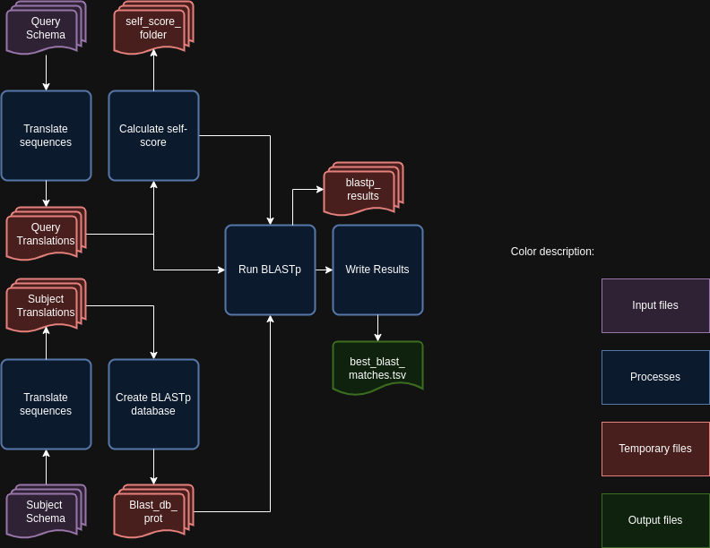

MatchSchemas - Match schemas in a directory
===========================================

Description
-----------

The `MatchSchemas` module parses command-line arguments and initiates the process to match schemas. This module sets up an argument parser to handle various command-line options for matching schemas and then calls the main function of the `MatchSchemas` class with the parsed arguments.

Features
--------

- Configurable parameters for the matching process.
- Support for parallel processing using multiple CPUs.
- Option to chose the processing mode.
- Option to skip cleanup after running the module.

Dependencies
------------

- Python 3.9 or higher
- Biopython library (`pip install biopython`)

Usage
-----

The `MatchSchemas` module can be used as follows:

.. code-block:: bash

    SR MatchSchemas -qs /path/to/query_schema -ss /path/to/subject_schema -o /path/to/output -c 4 -b 0.6 -tt 11 -pm alleles_vs_alleles --nocleanup

Command-Line Arguments
----------------------

::

    -qs, --query-schema-directory
        (Required) Folder that contains the query schema.

    -ss, --subject-schema-directory
        (Required) Folder that contains the subject schema.

    -o, --output-directory
        (Required) Path to the directory to which files will be stored.

    -c, --cpu
        (Optional) Number of CPUs to run BLAST instances.
        Default: 1

    -b, --bsr
        (Optional) BSR value to consider alleles as the same locus.
        Default: 0.6

    -tt, --translation_table
        (Optional) Translation table to use for the CDS translation.
        Default: 11

    -pm, --processing-mode
        (Optional) Mode to run the module.
        Choices: reps_vs_reps, reps_vs_alleles, alleles_vs_alleles, alleles_vs_reps.
        Default: alleles_vs_alleles

    --nocleanup
        (Optional) Flag to indicate whether to skip cleanup after running the module.

Algorithm Explanation
---------------------

MatchSchemas Algorithm Flowchart:

Outputs
-------
Folder and file structure for the output directory of the `MatchSchemas` module is shown below. The output directory contains the following files and folders:

::

    OutputFolderName
    ├── Blast # --nocleanup
    │   ├── Blast_db_prot
    │   │   ├── Blast_db_protein.pdb
    │   │   ├── Blast_db_protein.phr
    │   │   ├── Blast_db_protein.pin
    │   │   ├── Blast_db_protein.pog
    │   │   ├── Blast_db_protein.pos
    │   │   ├── Blast_db_protein.pot
    │   │   ├── Blast_db_protein.psq
    │   │   ├── Blast_db_protein.ptf
    │   │   └── Blast_db_protein.pto
    │   ├── blastp_results
    │   │   ├── blast_results_x.tsv
    │   │   ├── blast_results_y.tsv
    │   │   ├── blast_results_z.tsv
    │   │   └── ...
    │   ├── subject_master_file.fasta
    │   ├── Query_Translation
    │   │   ├── query_translations_x.fasta
    │   │   ├── query_translations_y.fasta
    │   │   ├── query_translations_z.fasta
    │   │   └── ...
    │   ├── Subject_Translation
    │   │   ├── subject_translations_x.fasta
    │   │   ├── subject_translations_y.fasta
    │   │   ├── subject_translations_z.fasta
    │   │   └── ...
    │   └── self_score_folder
    │       ├── blast_results_x.tsv
    │       ├── blast_results_y.tsv
    │       ├── blast_results_z.tsv
    │       └── ...
    └── best_blast_matches.tsv

Output files and folders description:
-------------------------------------

**OutputFolderName**
    The folder where the output files are stored.

Blast
    Folder containing BLASTp database, BLASTp output files, master file, self-score folder, and translation files.

    Blast_db_prot
        Folder containing the BLASTp database.
        
        Blast_db_protein.pdb
            Position-specific Data Base file. Contains position-specific scoring matrices (PSSMs) used in PSI-BLAST searches.
        
        Blast_db_protein.phr
            Protein Header Record file. Contains the header information for each sequence in the protein database.
        
        Blast_db_protein.pin
            Protein Index file. Contains the index of the sequences in the protein database.
        
        Blast_db_protein.pog
            Protein Organism Group file. Contains information about the taxonomic grouping of the sequences in the protein database.
        
        Blast_db_protein.pos
            Protein Organism Sequence file. Contains the actual sequence data for the protein database.
        
        Blast_db_protein.pot
            Protein Organism Taxonomy file. Contains taxonomic information for the sequences in the protein database.
        
        Blast_db_protein.psq
            Protein Sequence Query file. Contains the sequence data in a format optimized for BLAST searches.
        
        Blast_db_protein.ptf
            Protein Taxonomy File. Contains taxonomy information for the sequences in the protein database.
        
        Blast_db_protein.pto
            Protein Taxonomy Organism file. Contains organism-specific taxonomy information for the sequences in the protein database.

    blastp_results
        Folder containing the BLASTp output files.
        
        blast_results_x.tsv
            TSV file containing the BLASTp results for the locus x.
        
        blast_results_y.tsv
            TSV file containing the BLASTp results for the locus y.
        
        blast_results_z.tsv
            TSV file containing the BLASTp results for the locus z.
        
        ...
            All of the other TSV BLASTp results files.

    subject_master_file.fasta
        FASTA file containing all of the protein sequences used in the analysis (used to create BLAST DB).

    Query_Translation
        Folder containing the translation files.
        
        query_translations_x.fasta
            FASTA file containing the translation for the locus x.
        
        query_translations_y.fasta
            FASTA file containing the translation for the locus y.
        
        query_translations_z.fasta
            FASTA file containing the translation for the locus z.
        
        ...
            All of the other translation files.

    Subject_Translation
        Folder containing the translation files.
        
        subject_translations_x.fasta
            FASTA file containing the translation for the locus x.
        
        subject_translations_y.fasta
            FASTA file containing the translation for the locus y.
        
        subject_translations_z.fasta
            FASTA file containing the translation for the locus z.
        
        ...
            All of the other translation files.

    self_score_folder
        Folder containing the self-score BLAST results.
        
        blast_results_x.tsv
            TSV file containing the BLASTp results for self-score for the locus x.
        
        blast_results_y.tsv
            TSV file containing the BLASTp results for self-score for the locus y.
        
        blast_results_z.tsv
            TSV file containing the BLASTp results for the locus z.
        
        ...
            All of the other TSV BLASTp for self-score results files.

**best_blast_matches.tsv**
    TSV file containing the best BLAST matches for the query and subject schemas.

Report files description
------------------------

.. csv-table:: **best_blast_matches.tsv**
    :header: "Locus", "Best Match", "BSR"
    :widths: 30, 30, 10

    x, y, 0.8
    z, a, 1.0
    b, c, 0.965
    d, e, 0.94
    ...

columns description:

::
    
    Locus: The locus from the query schema.
    Best Match: The best match for the locus from the subject schema.
    BSR: The BSR value for the best match.

Examples
--------

Here are some example commands to use the `MatchSchemas` module:

.. code-block:: bash

    # Match schemas using default parameters
    SR MatchSchemas -qs /path/to/query_schema -ss /path/to/subject_schema -o /path/to/output

    # Match schemas with custom parameters
    SR MatchSchemas -qs /path/to/query_schema -ss /path/to/subject_schema -o /path/to/output -c 4 -b 0.7 -tt 4 -pm reps_vs_reps --nocleanup

Troubleshooting
---------------

If you encounter issues while using the `MatchSchemas` module, consider the following troubleshooting steps:

- Verify that the paths to the query and subject schema directories are correct.
- Check the output directory for any error logs or messages.
- Increase the number of CPUs using the `-c` or `--cpu` option if the process is slow.
