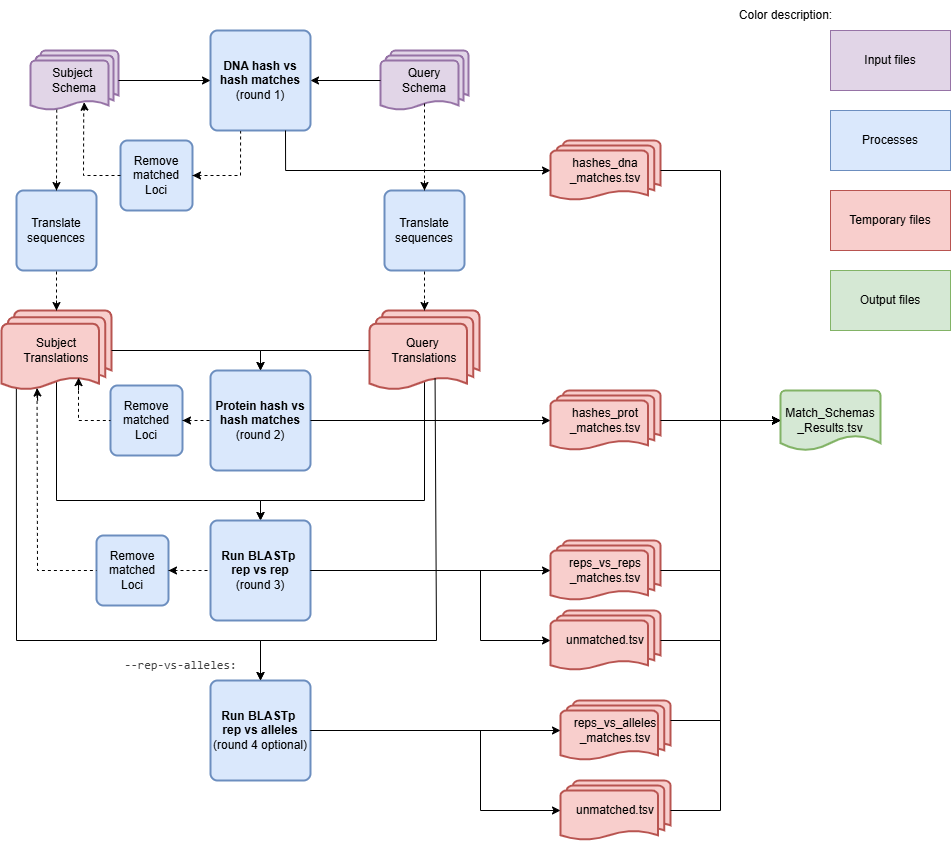

MatchSchemas - Match schemas in a directory
===========================================

Description
-----------

The `MatchSchemas` module parses command-line arguments and initiates the process to match schemas. This module sets up an argument parser to handle various command-line options for matching schemas and then calls the main function of the `MatchSchemas` class with the parsed arguments.

This module can be used to compare versions of schemas of the same species or schemas of two different species. It identifies matching loci between the two schemas.

Features
--------

- Configurable parameters for the matching process.
- Support for parallel processing using multiple CPUs.
- Option to skip cleanup after running the module.

Dependencies
------------

- Python 3.9 or higher
- BLAST (`https://www.ncbi.nlm.nih.gov/books/NBK279690/ <https://www.ncbi.nlm.nih.gov/books/NBK279690/>`_)
- Install requirements using the following command:

.. code-block:: bash

    pip install -r requirements.txt

Usage
-----

The `MatchSchemas` module can be used as follows:

.. code-block:: bash

    SR MatchSchema -fs /path/to/first_schema -ss /path/to/second_schema -o /path/to/output_folder -c 6 -b 0.5 --nocleanup

Command-Line Arguments
----------------------

::

    -fs, --first-schema-directory
        (Required) Folder that contains the first schema to identify paralogous loci.

    -ss, --second-schema-directory
        (Required) Folder that contains the second schema to identify paralogous loci.

    -o, --output-directory
        (Required) Path to the directory to which files will be stored.

    -c, --cpu
        (Optional) Number of CPUs to run BLAST instances.
        Default: 1

    -b, --bsr
        (Optional) BSR value to consider alleles as the same locus.
        Default: 0.6

    -tt, --translation-table
        (Optional) Translation table to use for the CDS translation.
        Default: 11

    -ra, --rep-vs-alleles
        (Optional) If True then after the rep vs rep Blast the program will run a second Blast with rep vs alleles.
        Default: False

    --nocleanup
        (Optional) Flag to indicate whether to skip cleanup after running the module.

    --debug
        (Optional) Flag to indicate whether to run the module in debug mode.
        Default: False

    --logger
        (Optional) Path to the logger file.
        Default: None

.. Note::
    The --rep_vs_alleles mode is a more indept comparision. It takes longer to process, however the number of extra matches found is small.
    Should be used as an extra and more detailed comparision.

Algorithm Explanation
---------------------

MatchSchemas Algorithm Flowchart:

The module assignes the designation of Query to the schema with higher allele density per loci.

The module goes throught three matching process and a fourth optional one.
    - DNA hashes comparision
    - Protein hashes comparision
    - Blast with reps vs reps
    - (optional) Blast with rep vs alleles

After each process it removes the subject loci that have been matched from the main dictionary so that they are not matched again.

Outputs
-------
Folder and file structure for the output directory of the `MatchSchemas` module is shown below. The output directory contains the following files and folders:

::

    OutputFolderName
    ├── blast_processing # --nocleanup
    │   ├── subject_reps_vs_reps_blastdb
    │   │   ├── subject_reps_vs_reps_blastdb.pdb
    │   │   ├── subject_reps_vs_reps_blastdb.phr
    │   │   ├── subject_reps_vs_reps_blastdb.pin
    │   │   ├── subject_reps_vs_reps_blastdb.pog
    │   │   ├── subject_reps_vs_reps_blastdb.pos
    │   │   ├── subject_reps_vs_reps_blastdb.pot
    │   │   ├── subject_reps_vs_reps_blastdb.psq
    │   │   ├── subject_reps_vs_reps_blastdb.ptf
    │   │   └── subject_reps_vs_reps_blastdb.pto
    │   ├── subject_reps_vs_alleles_blastdb
    │   │   ├── subject_reps_vs_alleles_blastdb.pdb
    │   │   ├── subject_reps_vs_alleles_blastdb.phr
    │   │   ├── subject_reps_vs_alleles_blastdb.pin
    │   │   ├── subject_reps_vs_alleles_blastdb.pog
    │   │   ├── subject_reps_vs_alleles_blastdb.pos
    │   │   ├── subject_reps_vs_alleles_blastdb.pot
    │   │   ├── subject_reps_vs_alleles_blastdb.psq
    │   │   ├── subject_reps_vs_alleles_blastdb.ptf
    │   │   └── subject_reps_vs_alleles_blastdb.pto
    │   ├── blastp_results
    │   │   ├── blast_results_x.tsv
    │   │   ├── blast_results_y.tsv
    │   │   ├── blast_results_z.tsv
    │   │   └── ...
    │   ├── Query_Translation
    │   │   ├── x_translation.fasta
    │   │   ├── y_translation.fasta
    │   │   ├── z_translation.fasta
    │   │   └── ...
    |   ├── Query_Translation_Rep
    │   │   ├── x_rep_translation.fasta
    │   │   ├── y_rep_translation.fasta
    │   │   ├── z_rep_translation.fasta
    │   │   └── ...
    │   ├── Subject_Translation
    │   │   ├── x_translation.fasta
    │   │   ├── y_translation.fasta
    │   │   ├── z_translation.fasta
    │   │   └── ...
    |   ├── Subject_Translation_Rep
    │   │   ├── x_rep_translation.fasta
    │   │   ├── y_rep_translation.fasta
    │   │   ├── z_rep_translation.fasta
    │   │   └── ...
    │   └── self_score_folder
    │       ├── blast_results_x.tsv
    │       ├── blast_results_y.tsv
    │       ├── blast_results_z.tsv
    │       └── ...
    ├── hashes_dna_matches.tsv
    ├── hashes_prot_matches.tsv
    ├── reps_vs_reps_matches.tsv
    ├── reps_vs_alleles_matches.tsv
    ├── unmatched.tsv
    └── Match_Schemas_Results.tsv

.. toctree::
   :maxdepth: 1

   MatchSchemasReportExplanation

Report files description
------------------------

.. csv-table:: **Match_Schemas_Results.tsv**
    :header: "Query", "Subject", "BSR", "Process"
    :widths: 20, 20, 10, 20

    x, y, 1.0, hashes_dna
    z, a, 1.0, hashes_prot
    b, c, 0.965, rep_vs_rep
    d, Not Matched, NA, rep_vs_rep
    Not Matched, e, NA, rep_vs_alleles
    ...

columns description:

::
    
    Query: The locus from the query schema.
    Subject: The best match for the locus from the subject schema.
    BSR: The BSR value for the best match.
    Process: From which type of comparision is this match from.

For the hashes comparisions the BSR value will always be set to 1.0 as this will be considered the same locus.

This file can be used as the input of the `SchemaAnnotation` module with the `match_schemas` option.

Examples
--------

Here are some example commands to use the `MatchSchemas` module:

.. code-block:: bash

    # Match schemas using default parameters
    SR MatchSchemas -fs /path/to/first_schema -ss /path/to/second_schema -o /path/to/output_folder

    # Match schemas with custom parameters
    SR MatchSchemas -fs /path/to/first_schema -ss /path/to/second_schema -o /path/to/output_folder -ra True -c 4 -b 0.7 -tt 4 --nocleanup

Troubleshooting
---------------

If you encounter issues while using the `MatchSchemas` module, consider the following troubleshooting steps:

- Verify that the paths to the query and subject schema directories are correct.
- Check the output directory for any error logs or messages.
- Increase the number of CPUs using the `-c` or `--cpu` option if the process is slow.
