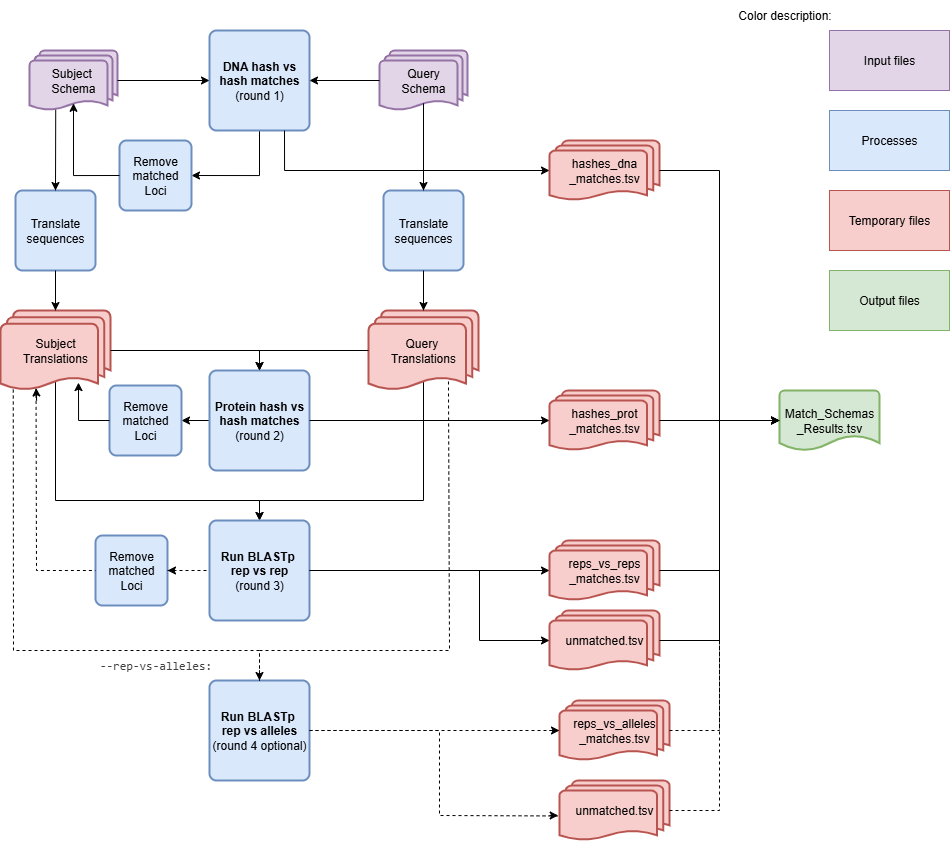

MatchSchemas - Match schemas in a directory
===========================================

Description
------------

The `MatchSchemas` module parses command-line arguments and initiates the process to match schemas. This module sets up an argument parser to handle various command-line options for matching two schemas and then calls the main function of the `MatchSchemas` class with the parsed arguments.

This module can be used to compare versions of schemas of the same species for updating one of the versions or compare what new information was added. The comparison of the schemas of two different species can also be of use and can be done with this module. It identifies matching loci between the two schemas and can annotate them for a more complete comparison.

Features
--------

- Configurable parameters for the matching process.
- Optional annotation of the final matches.
- Support for parallel processing using multiple CPUs.
- Option to skip cleanup after running the module.

Dependencies
------------

- Python between 3.9 and 3.11
- `BLAST <https://www.ncbi.nlm.nih.gov/books/NBK279690/>`_
- Install requirements using the following command:

.. code-block:: bash

    pip install -r requirements.txt

Usage
-----

The `MatchSchemas` module can be used as follows:

.. code-block:: bash

    SR MatchSchema -fs /path/to/first_schema -ss /path/to/second_schema -o /path/to/output_folder -c 6 -b 0.5 --nocleanup

Command-Line Arguments
----------------------

::

    -fs, --first-schema-directory
        (Required) Folder that contains the first schema to identify paralogous loci.

    -ss, --second-schema-directory
        (Required) Folder that contains the second schema to identify paralogous loci.

    -o, --output-directory
        (Required) Path to the directory to which files will be stored.

    -c, --cpu
        (Optional) Number of CPUs to run BLAST instances.
        Default: 1

    -b, --bsr
        (Optional) BSR value to consider alleles as the same locus.
        Default: 0.6

    -tt, --translation-table
        (Optional) Translation table to use for the CDS translation.
        Default: 11

    -ra, --rep-vs-alleles
        (Optional) If True then after the rep vs rep Blast the program will run a second Blast with rep vs alleles.
        Default: False

    --nocleanup
        (Optional) Flag to indicate whether to skip cleanup after running the module.

    --debug
        (Optional) Flag to indicate whether to run the module in debug mode.
        Default: False

    --logger
        (Optional) Path to the logger file.
        Default: None

.. Note::
    Always verify it the translation table (argument -tt) being used is the correct one for the species.

.. Note::
    The --rep_vs_alleles mode is a more indept comparison. It takes longer to process, however the number of extra matches found is small.
    Should be used as an extra and more detailed comparison.

Algorithm Explanation
---------------------

MatchSchemas Algorithm Flowchart:

::

The module assignes the designation of Query to the schema with higher allele density per loci. For later validation this naming match will be written in the log file. These input schemas should be in the format of the chewBBACA schemas.

The module goes throught three matching process and a fourth optional one.
    - DNA hashes comparison
    - Protein hashes comparison
    - Blast with reps vs reps
    - (optional) Blast with rep vs alleles

The DNA hashes comparison is the less flexible method. The loci need to have an exact match between nucleotide sequence in order to be matched. The protein comparison will catch loci which have nucleotide sequences that don't have a strong similarity but have redundant codons that will be translated into the same proteins. Finally, a BLASTp is done, which allows for an alignment of the protein sequences and finds similar proteins. The first BLAST will only align and compare the representative alleles of each scheam. The optional BLAST aligns the representative alleles of the query schema with all the alleles from the Subject schema.

The BLAST output will have the personalized format 6 with columns:
::
    qseqid sseqid qlen slen qstart qend sstart send length score gaps pident
::

The BLAST matches are dependent on the BSR value of that match. A Blast Score Ratio is a method for standardizing the genome comparison. A self-score, a comparison between the peptide sequence and the nucleotide sequence, is calculated to obtain the maximum BLAST score that could be obtained for a specific locus. The BLAST result is then divided by the self-score and if that value, between 0 and 1, is above a threshold, the result is written down as a match. The threshold can be set with the argument `--bsr`.

Each matching process is followed by a process where the loci that were matched are written in the main output file. The loci from the subject whose match was not yet found are then moved into the next matching step to be matched against all the query loci. After the final BLAST step, the loci which have no match will be added to the output file with the corresponding Query or Subject as 'Not Matched'.

Outputs
-------
Folder and file structure for the output directory of the `MatchSchemas` module is shown below. The output directory contains the following files and folders:

::

    OutputFolderName
    ├── blast_processing # --nocleanup
    │   ├── subject_reps_vs_reps_blastdb
    │   │   ├── subject_reps_vs_reps_blastdb.pdb
    │   │   ├── subject_reps_vs_reps_blastdb.phr
    │   │   ├── subject_reps_vs_reps_blastdb.pin
    │   │   ├── subject_reps_vs_reps_blastdb.pog
    │   │   ├── subject_reps_vs_reps_blastdb.pos
    │   │   ├── subject_reps_vs_reps_blastdb.pot
    │   │   ├── subject_reps_vs_reps_blastdb.psq
    │   │   ├── subject_reps_vs_reps_blastdb.ptf
    │   │   └── subject_reps_vs_reps_blastdb.pto
    │   ├── subject_reps_vs_alleles_blastdb
    │   │   ├── subject_reps_vs_alleles_blastdb.pdb
    │   │   ├── subject_reps_vs_alleles_blastdb.phr
    │   │   ├── subject_reps_vs_alleles_blastdb.pin
    │   │   ├── subject_reps_vs_alleles_blastdb.pog
    │   │   ├── subject_reps_vs_alleles_blastdb.pos
    │   │   ├── subject_reps_vs_alleles_blastdb.pot
    │   │   ├── subject_reps_vs_alleles_blastdb.psq
    │   │   ├── subject_reps_vs_alleles_blastdb.ptf
    │   │   └── subject_reps_vs_alleles_blastdb.pto
    │   ├── blastp_results
    │   │   ├── blast_results_x.tsv
    │   │   ├── blast_results_y.tsv
    │   │   ├── blast_results_z.tsv
    │   │   └── ...
    │   ├── Query_Translation
    │   │   ├── x_translation.fasta
    │   │   ├── y_translation.fasta
    │   │   ├── z_translation.fasta
    │   │   └── ...
    |   ├── Query_Translation_Rep
    │   │   ├── x_rep_translation.fasta
    │   │   ├── y_rep_translation.fasta
    │   │   ├── z_rep_translation.fasta
    │   │   └── ...
    │   ├── Subject_Translation
    │   │   ├── x_translation.fasta
    │   │   ├── y_translation.fasta
    │   │   ├── z_translation.fasta
    │   │   └── ...
    |   ├── Subject_Translation_Rep
    │   │   ├── x_rep_translation.fasta
    │   │   ├── y_rep_translation.fasta
    │   │   ├── z_rep_translation.fasta
    │   │   └── ...
    │   └── self_score_folder
    │       ├── blast_results_x.tsv
    │       ├── blast_results_y.tsv
    │       ├── blast_results_z.tsv
    │       └── ...
    ├── hashes_dna_matches.tsv
    ├── hashes_prot_matches.tsv
    ├── reps_vs_reps_matches.tsv
    ├── reps_vs_alleles_matches.tsv
    ├── unmatched.tsv
    └── Match_Schemas_Results.tsv

.. toctree::
   :maxdepth: 1

   MatchSchemasReportExplanation

Report files description
------------------------

.. csv-table:: **Match_Schemas_Results.tsv**
    :header: "Query", "Subject", "BSR", "Process"
    :widths: 20, 20, 10, 20

    x, y, 1.0, hashes_dna
    z, a, 1.0, hashes_prot
    b, c, 0.765, rep_vs_rep
    d, Not Matched, NA, rep_vs_rep
    Not Matched, e, NA, rep_vs_alleles
    ...

Columns description:
::
    
    Query: The loci from the query schema.
    Subject: The best loci matches from the subject schema.
    BSR: The BSR value for the best match.
    Process: From which type of comparison is this match from.

This final file is the made up of the merge of the temporary files `hashes_dna_matches.tsv`, `hashes_prot_matches.tsv`, `reps_vs_reps_matches.tsv` and `reps_vs_alleles_matches.tsv` if these are not empty.

For the hashes comparisons the BSR value will always be set to 1.0 as this will be considered the same locus. A locus from the Query schema can have more than one matches as the Subject loci are compared with the entire Query schema in each step. However, each Subject loci will only appear once with their best Query match.

This file can be used as the input of the `SchemaAnnotation` module with the `match_schemas` option.

Examples
--------

Here are some example commands to use the `MatchSchemas` module:

.. code-block:: bash

    # Match schemas using default parameters
    SR MatchSchemas -fs /path/to/first_schema -ss /path/to/second_schema -o /path/to/output_folder

    # Match schemas with custom parameters
    SR MatchSchemas -fs /path/to/first_schema -ss /path/to/second_schema -o /path/to/output_folder -ra True -c 4 -b 0.7 -tt 4 --nocleanup

Troubleshooting
---------------

If you encounter issues while using the `MatchSchemas` module, consider the following troubleshooting steps:

- Verify that the paths to the query and subject schema directories are correct.
- Check the output directory for any error logs or messages.
- Increase the number of CPUs using the `-c` or `--cpu` option if the process is slow.
- If it is a BLAST database related error, try deleting the BLAST folders in the output and run the command again and run the schema through the `AdaptLoci` as it checks for loci name conflicts.
