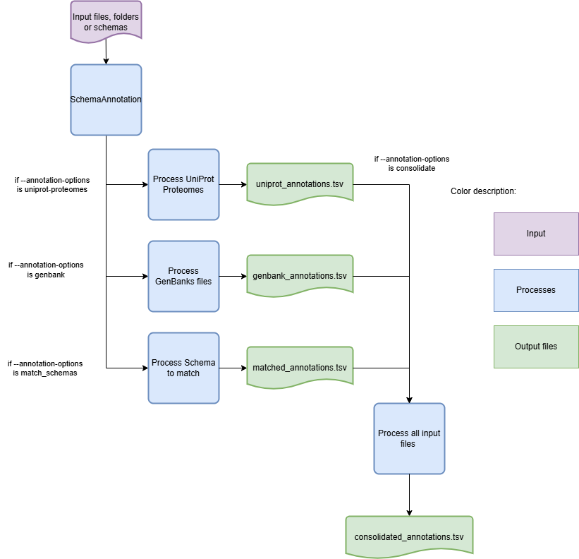
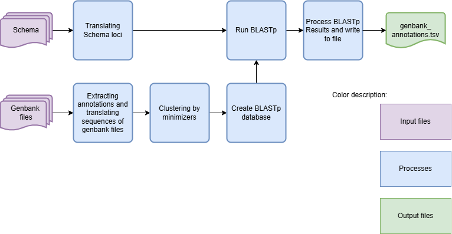

SchemaAnnotation - Annotate schemas
===================================

Description
-----------

The `SchemaAnnotation` module is a versatile tool designed to facilitate the annotation of genomic schemas. This module parses command-line arguments and initiates the schema annotation process, providing a flexible and user-friendly interface for researchers and bioinformaticians.

This module should be used as aid for reviewing the outputs of the other modules, as the annotations can make reviewing clusters and matches easier. It can also be used to simply annotated the final schema, or the schema being used for easier consultation later. 

Features
--------

- Annotating schemas in a directory.
- Join different annotation files.
- Configurable parameters for the annotation process.
- Support for parallel processing using multiple CPUs.
- Option to skip cleanup after running the module.

Dependencies
------------

- Python between 3.9 and 3.11
- BLAST (`https://www.ncbi.nlm.nih.gov/books/NBK279690/ <https://www.ncbi.nlm.nih.gov/books/NBK279690/>`_)
- Install requirements using the following command:

.. code-block:: bash

    pip install -r requirements.txt

Usage
-----

The `SchemaAnnotation` module can be used as follows:

.. code-block:: bash

    SR SchemaAnnotation -s /path/to/schema -o /path/to/output -ao uniprot-proteomes -pt path/to/proteome/table

Command-Line Arguments
----------------------

::

    -s, --schema-directory
        (Optional) Path to the schema's directory.  Needed for option 'uniprot-proteomes' and 'genbank'.

    -o, --output-directory
        (Required) Path to the output directory where to save the files.

    -ao, --annotation-options
        (Required) Annotation options to run.
        Choices: uniprot-proteomes, genbank, match-schemas, consolidate.

    -pt, --proteome-table
        (Optional) TSV file downloaded from UniProt that contains the list of proteomes.
        Should be used with --annotation-options uniprot-proteomes.

    -gf, --genbank-files
        (Optional) Path to the directory that contains Genbank files with annotations to extract.
        Each genbank file in this folder should be named after the ID it represents.
        Should be used with --annotation-options genbank.

    -ca, --chewie-annotations
        (Optional) File with the results from chewBBACA UniprotFinder module.

    -ms, --matched-schema
        (Optional) Path to the tsv output file from the MatchSchemas module (Match_Schemas_Results.tsv).

    -ma, --match-annotations
        (Optional) Path to the annotations file of one of the schemas used in the match schema module. This argument is needed by the Match Schemas submodule.
		Should be used with --annotation-options match_schema and --matched-schema.
    
    -cn, --consolidate-annotations
        (Optional) 2 or more paths to the files with the annotations that are to be consolidated.
    
    -cc, --consolidate-cleanup
        (Optional) For option consolidate the final files will or not have duplicates. Advised for the use of match schemas annotations.

    --bsr
        (Optional) Minimum BSR value to consider aligned alleles as alleles for the same locus. This argument is optional for the Match Schemas submodule.
        Default: 0.6

    -t, --threads
        (Optional) Number of threads for concurrent download.
        Default: 1

    -c, --cpu
        (Optional) Number of CPU cores for multiprocessing.
        Default: 1

    -r, --retry
        (Optional) Maximum number of retries when a download fails.
        Default: 7

    -tt, --translation-table
        (Optional) Translation table to use for the CDS translation.
        Default: 11

    -rm, --run-mode
        (Optional) Mode to run the module.
        Choices: reps, alleles.
        Default: reps

    -egtc, --extra-genbank-table-columns
        (Optional) List of columns to add to annotation file.
        Default: []

    -gia, --genbank-ids-to-add
        (Optional) List of GenBank IDs to add to final results.
        Default: []

    -pia, --proteome-ids-to-add
        (Optional) List of Proteome IDs to add to final results.
        Default: []
    
    --nocleanup
        (Optional) Flag to indicate whether to skip cleanup after running the module.

    --debug
        (Optional) Flag to indicate whether to run the module in debug mode.
        Default: False

    --logger
        (Optional) Path to the logger file.
        Default: None

.. Note::
    Always verify it the translation table (argument -tt) being used is the correct one for the species.

The `proteome-table` argument should be a TSV file with the selected proteomes, from TrEMBL and swissprot, that can be downloaded directly from `UniProt <https://www.uniprot.org/proteomes?query=*>`_ . Have in mind that the downloaded folder will be zipped. Before putting it as an input unzip it and select only the TSV file.

The `genbank-files` argument should be a folder with gbff files named after each genome. This implies some file manipulation so that the names are correct and under a singular folder.

For the annotation files from the option "consolidate" and "match_schemas" it is important to ensure that the loci names match between files. If not, the algorithm will not be able to match the annotations to the loci.

Algorithm Explanation
---------------------

The `SchemaAnnotation` module annotates using three different options: `GenBank files`, `UniProt proteomes`, `Match Schemas`, and `Consolidate`.
The following is the flowchart for the `SchemaAnnotation` module:

After each annotation files are processed, the annotations are match to their locus based on the locus name or alignment of sequences.

The `SchemaAnnotation` module annotates using `UniProt proteomes` based on the following Flowchart:

For this process, the annoatations are first separated into swiss-prot and TrEMBL and then processed. From there, a BLASTp is done in order to align and macth the protein sequences from the input schema and the proteomes from UniProt.

The BLAST output will have the personalized format 6 with columns:
::
    qseqid sseqid qlen slen qstart qend sstart send length score gaps pident
::

From the output, the `uniprot_annotations.tsv` file is the ine that compiles all the final annotations from swiss-prot and TrEMBL.

The `SchemaAnnotation` module annotates using `GenBank files` based on the following Flowchart:

For this algorithm, the annotations are also matched through a BLASTp alignment. The final output file will have the annotations given to the best match of all the loci.

For the options `Match Schemas` and `Consolidate` the process is the merging of the given files based on the locus columns that are the have the highest amount of matches between files. For these modes it is not necessary to give an inout schema as an input argument. Be aware that the loci names should match in between the annotations files and the loci column to be merged should be one of the first two columns in the files. 

Outputs
-------
Folder and file structure for the output directory of the `SchemaAnnotation` module is shown below. The output directory contains the following files and folders:

::

    OutputFolderName
    ├── # --nocleanup -ao genbank
    ├── genbank_annotations.tsv
    ├── genbank_annotations 
    |   ├── genbank_annotations.tsv
    │   ├── best_annotations_all_genbank_files
    │   │   └── best_genbank_annotations.tsv
    │   ├── best_annotations_per_genbank_file
    │   │   ├── genbank_file_x_annotations.tsv
    │   │   ├── genbank_file_y_annotations.tsv
    │   │   └── ...
    │   ├── blast_processing
    │   │   ├── selected_genbank_proteins.fasta
    │   │   ├── blast_db
    │   │   │   ├── blast_db_protein.pdb
    │   │   │   ├── blast_db_protein.phr
    │   │   │   ├── blast_db_protein.pin
    │   │   │   ├── blast_db_protein.pog
    │   │   │   ├── blast_db_protein.pos
    │   │   │   ├── blast_db_protein.pot
    │   │   │   ├── blast_db_protein.psq
    │   │   │   ├── blast_db_protein.ptf
    │   │   │   └── blast_db_protein.pto
    │   │   ├── blastp_results
    │   │   │   ├── blast_results_x.tsv
    │   │   │   ├── blast_results_y.tsv
    │   │   │   └── ...
    │   │   └── self_score_folder
    │   │       ├── blast_results_x.tsv
    │   │       ├── blast_results_y.tsv
    │   │       └── ...
    │   └── reps_translations
    │       ├── x_translation.fasta
    │       ├── y_translation.fasta
    │       └── ...
    |
    ├── # --nocleanup -ao match-schemas
    ├── matched_annotations.tsv
    |
    ├── # --nocleanup -ao uniprot-proteomes
    ├── uniprot_annotations.tsv
    ├── uniprot_annotations
    |   ├── best_proteomes_annotations_swiss_prot.tsv
    |   ├── best_proteomes_annotations_trEMBL.tsv
    |   ├── proteome_matcher_output
    |   │   ├── best_annotations_per_proteome_file
    |   │   │   ├── Swiss-Prot
    |   │   │   │   ├── proteome_file_x_Swiss-Prot_annotations.tsv
    |   │   │   │   ├── proteome_file_y_Swiss-Prot_annotations.tsv
    |   │   │   │   └── ...
    |   │   │   └── TrEMBL
    |   │   │       ├── proteome_file_x_TrEMBL_annotations.tsv
    |   │   │       ├── proteome_file_y_TrEMBL_annotations.tsv
    |   │   │       └── ...
    |   │   ├── reps_translations
    |   │   │   ├── x_translation.fasta
    |   │   │   ├── y_translation.fasta
    |   │   │   └── ...
    |   │   ├── self_score_folder
    |   │   │   ├── blast_results_x.tsv
    |   │   │   ├── blast_results_y.tsv
    |   │   │   └── ...
    |   |   ├── swiss_prots_processing
    |   |   │   ├── blast_processing
    |   |   │   │   ├── blast_db
    |   |   │   │   │   ├── blast_db_protein.pdb
    |   |   │   │   │   ├── blast_db_protein.phr
    |   |   │   │   │   ├── blast_db_protein.pin
    |   |   │   │   │   ├── blast_db_protein.pog
    |   |   │   │   │   ├── blast_db_protein.pos
    |   |   │   │   │   ├── blast_db_protein.pot
    |   |   │   │   │   ├── blast_db_protein.psq
    |   |   │   │   │   ├── blast_db_protein.ptf
    |   |   │   │   │   └── blast_db_protein.pto
    |   |   │   │   ├── blastp_results
    |   |   │   │   │   ├── blast_results_x.tsv
    |   |   │   │   │   ├── blast_results_y.tsv
    |   |   │   │   │   └── ...
    |   |   │   │   └── swiss_prots.fasta
    |   |   │   └── swiss_prots_annotations.tsv
    |   |   └── trembl_prots_processing
    |   |       ├── blast_processing
    |   |       │   ├── blast_db
    |   |       │   │   ├── blast_db_protein.pdb
    |   |       │   │   ├── blast_db_protein.phr
    |   |       │   │   ├── blast_db_protein.pin
    |   |       │   │   ├── blast_db_protein.pog
    |   |       │   │   ├── blast_db_protein.pos
    |   |       │   │   ├── blast_db_protein.pot
    |   |       │   │   ├── blast_db_protein.psq
    |   |       │   │   ├── blast_db_protein.ptf
    |   |       │   │   └── blast_db_protein.pto
    |   |       │   ├── blastp_results
    |   |       │   │   ├── blast_results_x.tsv
    |   |       │   │   ├── blast_results_y.tsv
    |   |       │   │   └── ...
    |   |       │   └── trembl_prots.fasta
    |   |       └── trembl_prots_annotations.tsv    
    |   ├── Proteomes
    |   |   ├── Proteome_x.fasta.gz
    |   |   ├── Proteome_x.fasta.gz
    |   |   └── ...
    |   └── split_proteomes
    |       ├── prots_descriptions
    |       ├── swiss_prots.fasta
    |       └── trembl_prots.fasta 
    ├── # --nocleanup -ao consolidate
    └── consolidated_annotations.tsv 

.. toctree::
   :maxdepth: 1

   SchemaAnnotationOutputExplanation

Report files description
------------------------

.. csv-table:: uniprot_annotations.tsv
    :header: "Locus", "Proteome_ID", "Proteome_product", "Proteome_gene_name", "Proteome_BSR", "Proteome_ID_best_proteomes_annotations_swiss_prot", "Proteome_product_best_proteomes_annotations_swiss_prot", "Proteome_gene_name_best_proteomes_annotations_swiss_prot", "Proteome_BSR_best_proteomes_annotations_swiss_prot"
    :widths: 20, 20, 20, 20, 15, 20, 20, 20, 20, 20

    x, tr|Q8DZC3|Q8DZC3_STRA5, Ribonuclease J, rnj, 1.0, NA, NA, NA, NA
    y, tr|R4ZAV0|R4ZAV0_STRAG, Alkaline shock protein, AX245_09465, 1.0, NA, NA, NA, NA
    z, tr|A0A0E1EGL7|A0A0E1EGL7_STRAG, Phosphoenolpyruvate carboxylase, ppc, 1.0, sp|Q8E0H2|CAPP_STRA5, Phosphoenolpyruvate carboxylase, ppc, 1.0
    ...

.. csv-table:: genbank_annotations.tsv
    :header: "Locus", "Genbank_ID", "Genbank_gene_name", "Genbank_product", "Genbank_BSR"
    :widths: 20, 20, 20, 20, 15

    x, AMD32818.1, NA, cysteine desulfurase, 0.9932627526467758	
    y, AMD31754.1, NA, histidine triad protein, 0.9891156462585035	
    z, AMD31913.1, rplS, 50S ribosomal protein L19, 1.0	
    ...

.. csv-table:: matched_annotations.tsv if made with uniprot annotations
    :header: "Query", "Subject", "BSR", "Process", "matched_Proteome_ID", "matched_Proteome_product", "matched_Proteome_gene_name", "matched_Proteome_BSR", "matched_Proteome_ID_best_proteomes_annotations_swiss_prot", "matched_Proteome_product_best_proteomes_annotations_swiss_prot", "matched_Proteome_gene_name_best_proteomes_annotations_swiss_prot", "matched_Proteome_BSR_best_proteomes_annotations_swiss_prot"
    :widths: 20, 20, 20, 20, 15, 20, 20, 20, 20, 20, 15, 5

    x, a, 1.0, hashes_dna, tr|X5K2G1|X5K2G1_STRAG, dITP/XTP pyrophosphatase, rdgB, 1.0, sp|Q8DY93|IXTPA_STRA5, dITP/XTP pyrophosphatase, SAG1599, 1.0
    y, b, 1.0, hashes_dna, tr|A0AAW3HT12|A0AAW3HT12_STRAG, tRNA N6-adenosine threonylcarbamoyltransferase, tsaD, 1.0, sp|Q8DXT9|TSAD_STRA5, tRNA N6-adenosine threonylcarbamoyltransferase, tsaD, 1.0
    z, c, 1.0, hashes_dna, tr|A0AAE9TM16|A0AAE9TM16_STRAG, PTS fructose transporter subunit IIC, NCTC8184_00378, 1.0, , , , 
    ...

Columns description:

::

    Locus: The locus from the query schema.
    (matched_)Proteome_ID: The identifier for the trEMBL protein.
    (matched_)Proteome_product: The product of the trEMBL protein.
    (matched_)Proteome_gene_name: The gene name of the trEMBL protein.
    (matched_)Proteome_BSR: The BLAST Score Ratio for the trEMBL protein.
    (matched_)Proteome_ID_best_proteomes_annotations_swiss_prot: The identifier for the swiss prot protein.
    (matched_)Proteome_product_best_proteomes_annotations_swiss_prot: The product of the swiss prot protein.
    (matched_)Proteome_gene_name_best_proteomes_annotations_swiss_prot: The gene name of the swiss prot protein.
    (matched_)Proteome_BSR_best_proteomes_annotations_swiss_prot: The BLAST Score Ratio for the swiss prot protein.
    Genebank_ID: The GenBank origin ID.
    Genebank_product: The product of the GenBank origin.
    Genebank_gene_name: The name of the GenBank origin.
    Genebank_BSR: The BSR value for the best GenBank annotations.
    Query: The locus from the query schema.
    Subject: The locus from the subject schema.
    BSR: The BSR value for the best loci matches.
    Process: Process where that match was found in MatchSchemas.

.. Note::
    The `consolidated_annotations.tsv` contains all the annotations that user chose to annotate given in the "-cn" argument.

Consolidate column suffixes:

- _file_x 
    x being the number of the file that column comes from.
    Which file corresponds to which number is specified in the output log file.
- None
    The columns that have a unique header or are the first instance of that header will not have any suffix.
    

Examples
--------

Here are some example commands to use the `SchemaAnnotation` module:

.. code-block:: bash

    # Annotate schema using default parameters
    SR SchemaAnnotation -s /path/to/schema -o /path/to/output -ao uniprot-proteomes -pt path/to/proteome/table

    # Annotate schema with custom parameters
    SR SchemaAnnotation -o /path/to/output -ao consolidate -cn 'path/to/uniprot_annotations/output' 'path/to/genebank_annotations/output' -c 4 -t 4 -b 0.7 -tt 1 --nocleanup

Troubleshooting
---------------

If you encounter issues while using the `SchemaAnnotation` module, consider the following troubleshooting steps:

- Verify that the paths to the schema and output directories are correct.
- Check the output directory for any error logs or messages.
- Increase the number of CPUs using the `-c` or `--cpu` option if the process is slow.
- If it is a BLAST database related error, try deleting the BLAST folders in the output and run the command again and run the schema through the `AdaptLoci` as it checks for loci name conflicts.
