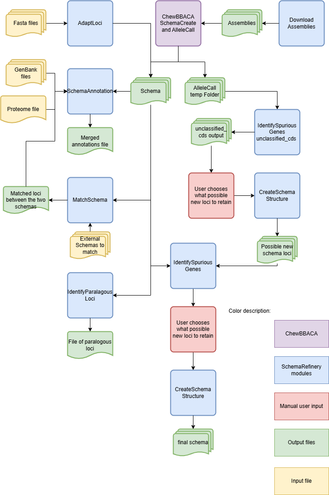

Overview
========

Description
-----------

The `SchemaRefinery` is a comprehensive toolkit designed for refining and managing genomic schemas. It provides a suite of modules for various tasks such as identifying paralogous loci, downloading genomic assemblies, and adapting loci into standardized schemas.

Dependencies
------------

- Python 3.9 or higher
- Biopython library (`pip install biopython`)
- NCBI datasets (`https://www.ncbi.nlm.nih.gov/datasets/ <https://www.ncbi.nlm.nih.gov/datasets/>`_)

Modules
-------

The repository includes the following main modules:

1. **IdentifyParalogousLoci**: Identifies paralogous loci in a schema.
2. **IdentifySpuriousGenes**: Identifies spurious genes in a schema.
3. **SchemaAnnotation**: Annotates schemas with additional information.
4. **MatchSchemas**: Matches schemas in a directory.
5. **DownloadAssemblies**: Downloads genomic assemblies from various databases.
6. **AdaptLoci**: Adapts loci in fasta format to a schema format.

Modules Usage
-------------

Each module can be used independently by running the corresponding script with the required command-line arguments. Below are examples for each module:

`IdentifyParalogousLoci documentation <https://schema-refinery.readthedocs.io/en/latest/SchemaRefinery/Modules/IdentifyParalagousLoci.html>`_

.. code-block:: bash

    SR IdentifyParalogousLoci --help

`IdentifySpuriousGenes documentation <https://schema-refinery.readthedocs.io/en/latest/SchemaRefinery/Modules/IdentifySpuriousGenes.html>`_

.. code-block:: bash

    SR IdentifySpuriousGenes --help

`SchemaAnnotation documentation <https://schema-refinery.readthedocs.io/en/latest/SchemaRefinery/Modules/SchemaAnnotation.html>`_

.. code-block:: bash

    SR SchemaAnnotation --help

`MatchSchemas documentation <https://schema-refinery.readthedocs.io/en/latest/SchemaRefinery/Modules/MatchSchemas.html>`_

.. code-block:: bash

    SR MatchSchemas --help

`DownloadAssemblies documentation <https://schema-refinery.readthedocs.io/en/latest/SchemaRefinery/Modules/DownloadAssemblies.html>`_

.. code-block:: bash

    SR DownloadAssemblies --help

`AdaptLoci documentation <https://schema-refinery.readthedocs.io/en/latest/SchemaRefinery/Modules/AdaptLoci.html>`_

.. code-block:: bash

    SR AdaptLoci --help

Schema Creation Workflow
------------------------

Workflow for creating a schema using the `SchemaRefinery` modules and chewBBACA:

Troubleshooting
---------------

If you encounter issues while using the modules, consider the following troubleshooting steps:

- Verify that the paths to the schema, output, and other directories are correct.
- Check the output directory for any error logs or messages.
- Increase the number of CPUs using the `-c` or `--cpu` option if the process is slow.
- Ensure that you have a stable internet connection.

if the issue persists, please report it to the development team using github issues.

Contributing
------------

We welcome contributions to the SchemaRefinery project. If you would like to contribute, please follow these steps:

1. Fork the repository on GitHub.
2. Create a new branch for your feature or bugfix.
3. Make your changes and commit them with a clear message.
4. Push your changes to your forked repository.
5. Create a pull request to the main repository.

License
-------

This project is licensed under the GNU General Public License v3.0. See the `LICENSE <https://www.gnu.org/licenses/gpl-3.0.html>`_ file for details.
Contact Information
-------------------

For support or to report issues, please contact the development team at github issues in `SchemaRefinery GitHub repository <https://github.com/B-UMMI/Schema_Refinery>`_.