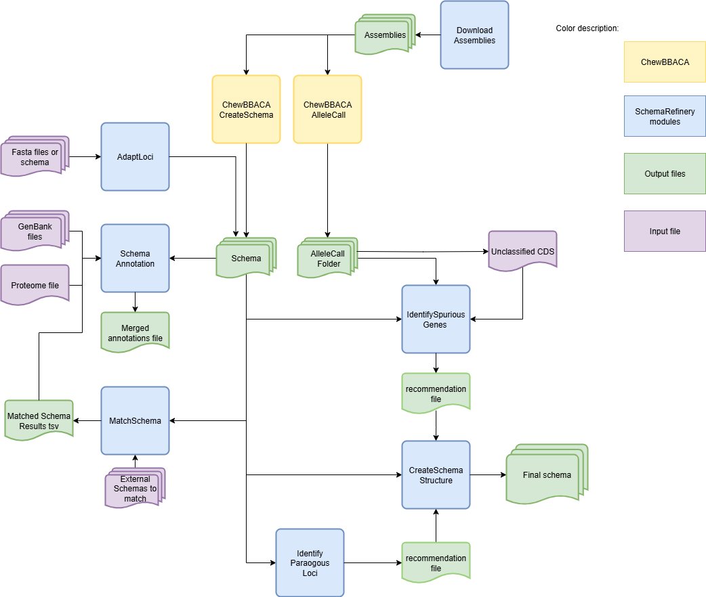

Overview
========

Description
-----------

The `SchemaRefinery` is a comprehensive toolkit designed for refining and managing genomic schemas. It provides a suite of modules for various tasks such as identifying paralogous and spurious loci, downloading genomic assemblies, annotating shcemas and adapting loci into standardized schemas.

This toolkit is suited for managing and processing schemas created using chewBBACA or other tools. Features like annotating and refining modules are useful for better understand the information contained in the schema. The objective of this tool it to help in the creation of a more polish and useful schema for later reference.

Dependencies
------------

- Python between 3.9 and 3.11
- `BLAST <https://www.ncbi.nlm.nih.gov/books/NBK279690/>`_
- `NCBI datasets <https://www.ncbi.nlm.nih.gov/datasets/>`_
- Install requirements using the following command:

.. code-block:: bash

    pip install -r requirements.txt

Modules
-------

The repository includes the following main modules:

1. **IdentifyParalogousLoci**: Identifies paralogous loci in a schema.
2. **IdentifySpuriousGenes**: Identifies spurious genes in a schema.
3. **SchemaAnnotation**: Annotates schemas with additional information.
4. **MatchSchemas**: Matches schemas in a directory.
5. **DownloadAssemblies**: Downloads genomic assemblies from various databases.
6. **AdaptLoci**: Adapts loci in fasta format to a schema format.

Modules Usage
-------------

Each module can be used independently by running the corresponding script with the required command-line arguments. Below are examples for each module:

`IdentifyParalogousLoci documentation <https://schema-refinery.readthedocs.io/en/latest/SchemaRefinery/Modules/IdentifyParalogousLoci.html>`_

.. code-block:: bash

    SR IdentifyParalogousLoci --help

`IdentifySpuriousGenes documentation <https://schema-refinery.readthedocs.io/en/latest/SchemaRefinery/Modules/IdentifySpuriousGenes.html>`_

.. code-block:: bash

    SR IdentifySpuriousGenes --help

`SchemaAnnotation documentation <https://schema-refinery.readthedocs.io/en/latest/SchemaRefinery/Modules/SchemaAnnotation.html>`_

.. code-block:: bash

    SR SchemaAnnotation --help

`MatchSchemas documentation <https://schema-refinery.readthedocs.io/en/latest/SchemaRefinery/Modules/MatchSchemas.html>`_

.. code-block:: bash

    SR MatchSchemas --help

`DownloadAssemblies documentation <https://schema-refinery.readthedocs.io/en/latest/SchemaRefinery/Modules/DownloadAssemblies.html>`_

.. code-block:: bash

    SR DownloadAssemblies --help

`AdaptLoci documentation <https://schema-refinery.readthedocs.io/en/latest/SchemaRefinery/Modules/AdaptLoci.html>`_

.. code-block:: bash

    SR AdaptLoci --help

Schema Creation Workflow
------------------------

Workflow for creating a schema using the `SchemaRefinery` modules and `chewBBACA`:

`SchemaRefinery` does not have a specific sequence in which the modules most be used. The starting and ending points will depend on the objective of the user. However, it is recommended to run the `AdaptLoci` module as the first step as the tool works with the chewBBACA schema structure. 

The modules can be used almost completely without a specific order. In the case of the `SchemaAnnotation` module with the match-schemas mode, the `MatchSchemas` module has to be run before. For the `CreateSchemaStructure` module, the input file has to be the output of either the `IdentifyParalogousLoci` or the `IdentifySpuriousGenes` modules.

User Cases
-----------

Comparing an old and new version of a schema:
^^^^^^^^^^^^^^^^^^^^^^^^^^^^^^^^^^^^^^^^^^^^^^
In this case we want to compare and old and new version of the same schema to better understand the changes done. We will annotate it using information from the old schema to better understand what information was mantained.

1. Pass the schemas through `AdaptLoci`:
    .. code-block:: bash
        SR AdaptLoci -i path/to/old_schema -o path/to/old_schema_formatted -c 4
        SR AdaptLoci -i path/to/new_schema -o path/to/new_schema_formatted -c 4

If there's any recommended changes to be done to the names, take them into consideration and change these loci names to avoid errors down the line.

2. Match these schemas using `MatchSchema`:
    .. code-block:: bash
        SR MatchSchema -fs path/to/old_schema_formatted -ss path/to/new_schema_formatted -o path/to/MatchSchema_output -c 6

3. Annotate the old schema using the uniprot option of `SchemaAnnotation`:
    .. code-block:: bash
        SR SchemaAnnotation -s path/to/old_schema_formatted -o path/to/SchemaAnnotation_old_schema_uniprot -ao uniprot-proteomes -pt path/to/proteome_list -c 4

4. Annotate the MatchSchema output with the match-schemas option of `SchemaAnnotation`:
    .. code-block:: bash
        SR SchemaAnnotation -ms path/to/MatchSchema_output/Match_Schemas_Results.tsv -ma path/to/SchemaAnnotation_old_schema_uniprot/uniprot_annotations.tsv -ao match-schemas -o path/to/SchemaAnnotation_match_schemas -c 4

The step 3 and 4 can be repeated with the new schema. The output files from the step 4 done for old and new schemas can the be merged using the option `consolidate` of the `SchemaAnnotation` module for a more complete comparison.

Refine a newly created schema:
^^^^^^^^^^^^^^^^^^^^^^^^^^^^^^^^^
We have created a new schema using chewBBACA's CreateSchema and now want to refine it. We are starting after having already ran CreateSchema and AlleleCall from chewBBACA.

Since the schema comes directly from chewBBACA we can skip the `AdaptLoci` step.

1. Annotate the schema using the genbank option from the `SchemaAnnotation`:
    .. code-block:: bash
        SR SchemaAnnotation -s path/to/schema/schema_seed -gf path/to/genbank_folder -o path/to/SchemaAnnotation_genbank -ao genbank -c 6

2. Run the `IdentifySpuriousGenes` module to find spurious genes within this schema:
We will annotate the output to better review the output recommendations.
    .. code-block:: bash
        SR IdentifySpuriousGenes -s path/to/schema/schema_seed -a path/to/allele_call_output -m schema -ann path/to/SchemaAnnotation_genbank/genbank_annotations.tsv -o path/to/IdentifySpuriousGenes_schema_annotated -c 6 

We analyse the output **recommendations_annotations.tsv**. For the next step we change all the "Choice" actions into "Join", "Add", or "Drop". After veryfying the other recommendations and making the changes we deem necessary we move on to step 3.

3. Create a new schema using the `altered` **recommendations_annotations.tsv** file from the previous step and the module `CreateSchemaStructure`:
    .. code-block:: bash
        SR CreateSchemaStructure -s path/to/schema/schema_seed -rf path/to/IdentifySpuriousGenes_schema_annotated/recommendations_annotations.tsv -o path/to/CreateSchemaStructure_refined_schema -c 6

We now have a refined version of the newly created schema costumized to our decisions!

The step 2 could be done with the mode `unclassified_cds`, the input folders would be the same but the loci to be analysed would have been the ones that chewBBACA couldn't classify. It could have also been done using the `IdentifyParalogousLoci` module. It would be a refinement based on paralogous instead of spurious genes, therefore the recommendations would be either "Join" or "Add".

Create a new schema and refine it by finding the paralogous genes:
^^^^^^^^^^^^^^^^^^^^^^^^^^^^^^^^^^^^^^^^^^^^^^^^^^^^^^^^^^^^^^^^^^^
We will start before even creating the schema using the chewBBACA tool.

1. Download the assemblies needed for creating the schema using `DownloadAssemblies`:
    .. code-block:: bash
        SR DownloadAssemblies -f path/to/input_tsv_file_with_taxon -db NCBI -e youremail@example.com -o path/to/DownloadAssemblies_NCBI_download -fm --download

2. Using chewBBACA create the schema:
    .. code-block:: bash
        chewBBACA.py CreateSchema -i path/to/DownloadAssemblies_NCBI_download/assemblies_ncbi_unziped --n mySchema -o path/to/CreateSchema_chewbbaca_mySchema

The new schema was created! Now we refine it.

3. Annotate this new schema using the `uniprot` mode in the `SchemaAnnotation` modules:
    .. code-block:: bash 
        SR SchemaAnnotation -s path/to/CreateSchema_chewbbaca_mySchema/mySchema/schema_seed -o path/to/SchemaAnnotation_mySchema_uniprot -ao uniprot-proteomes -pt path/to/proteome_list -c 4

4. Refine the schema using the `IdentifyParalogousLoci` module:
We are going to annotate the recommendation output for better analysis. We will run it with the processing mode reps_vs_alleles to have a more complete output, however, this will take more time to run. 
    .. code-block:: bash
        SR IdentifyParalogousLoci -s path/to/CreateSchema_chewbbaca_mySchema/mySchema/schema_seed -o path/to/IdentifyParalogousLoci_mySchema_repsvsall -pm reps_vs_alleles -ann path/to/SchemaAnnotation_mySchema_uniprot/uniprot_annotations.tsv -c 6

We analyse the output **paralogous_annotations.tsv**. After veryfying the recommendations and the clusters and making the changes we seem necessary we move on to step 5.

5. Create a final schema based on the `altered` **paralogous_annotations.tsv** file:

    .. code-block:: bash 
        SR CreateSchemaStructure -s path/to/CreateSchema_chewbbaca_mySchema/mySchema/scheam_seed -rf path/to/IdentifyParalogousLoci_mySchema_repsvsall/paralogous_annotations.tsv -o path/to/CreateSchemaStructure_refined_mySchema -c 6

We now have a refined version of the newlly created schema costumized to our decisions!

In any of these cases the `--nocleanup` option can be used in any step to keep in the output folder all the temporary files, if these are needed for checking progress or other data from, for example, the BLAST process. Values like the bsr and clustering similarity, among others, can be changed using the corresponding arguments. 
.. Note::
    Always verify it the translation table (argument -tt) being used is the correct one for the species.

For another run example check the `Full Tutorial`.

Troubleshooting
---------------

If you encounter issues while using the modules, consider the following troubleshooting steps:

- Verify that the paths to the schema, output, and other directories are correct.
- Check the output directory for any error logs or messages.
- Increase the number of CPUs using the `-c` or `--cpu` option if the process is slow.
- Ensure that you have a stable internet connection.
- If it is a BLAST database related error, try deleting the BLAST folders in the output and run the command again and run the schema through the `AdaptLoci` as it checks for loci name conflicts.

If the issue persists, please report it to the development team using GitHub issues.

Contributing
------------

We welcome contributions to the SchemaRefinery project. If you would like to contribute, please follow these steps:

1. Fork the repository on GitHub.
2. Create a new branch for your feature or bugfix.
3. Make your changes and commit them with a clear message.
4. Push your changes to your forked repository.
5. Create a pull request to the main repository.

License
-------

This project is licensed under the GNU General Public License v3.0. See the `LICENSE <https://www.gnu.org/licenses/gpl-3.0.html>`_ file for details.

Contact Information
-------------------

For support or to report issues, please contact the development team at GitHub issues in `SchemaRefinery GitHub repository <https://github.com/B-UMMI/Schema_Refinery>`_.