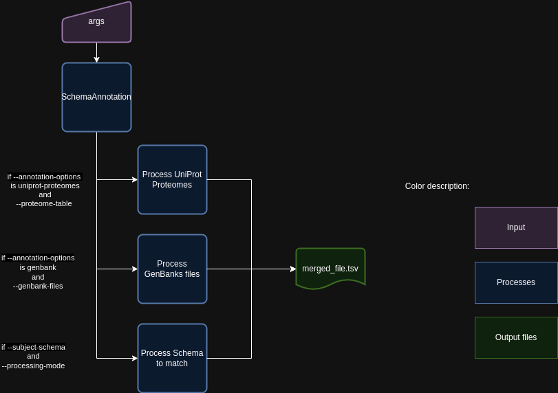
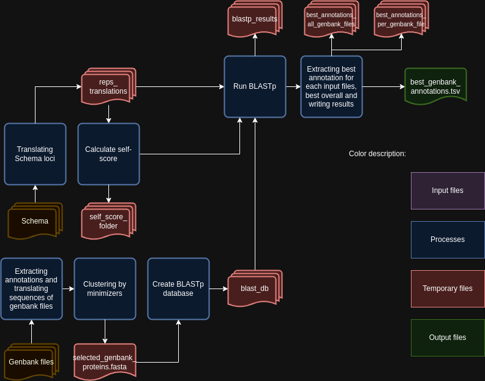
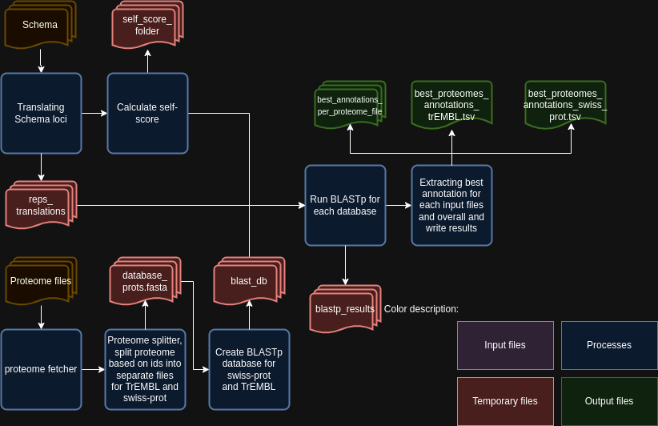
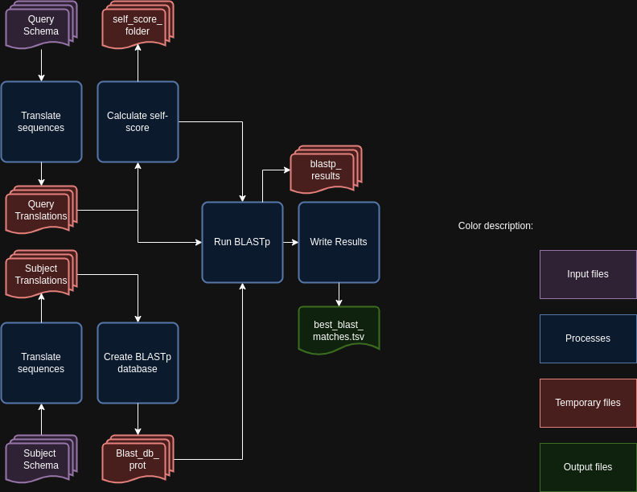

.. _SchemaAnnotation:

SchemaAnnotation - Annotate schemas
===================================

Description
-----------

The `SchemaAnnotation` module parses command-line arguments and initiates the schema annotation process. This module sets up an argument parser to handle various command-line options for annotating schemas and then calls the main function of the `SchemaAnnotation` class with the parsed arguments.

Features
--------

- Annotating schemas in a directory.
- Configurable parameters for the annotation process.
- Support for parallel processing using multiple CPUs.
- Option to skip cleanup after running the module.

Dependencies
------------

- Python 3.6 or higher
- Biopython library (`pip install biopython`)

Usage
-----

The `SchemaAnnotation` module can be used as follows:

.. code-block:: bash

    SR SchemaAnnotation -s /path/to/schema -o /path/to/output -ao uniprot-proteomes genbank-files -pt path/to/proteome/table -gf path/to/genbank/files

Command-Line Arguments
----------------------

::

    -s, --schema-directory
        (Required) Path to the schema's directory.

    -o, --output-directory
        (Required) Path to the output directory where to save the files.

    -ao, --annotation-options
        (Required) Annotation options to run.
        Choices: uniprot-proteomes, genbank-files, match-schemas.

    -pt, --proteome-table
        (Optional) TSV file downloaded from UniProt that contains the list of proteomes.

    -gf, --genbank-files
        (Optional) Path to the directory that contains Genbank files with annotations to extract.

    -ca, --chewie-annotations
        (Optional) File with the results from chewBBACA UniprotFinder module.

    -ss, --subject-schema
        (Optional) Path to the subject schema directory. This argument is needed by the Match Schemas sub-module.

    --bsr
        (Optional) Minimum BSR value to consider aligned alleles as alleles for the same locus.
        Default: 0.6

    -t, --threads
        (Optional) Number of threads for concurrent download.
        Default: 1

    -c, --cpu
        (Optional) Number of CPU cores for multiprocessing.
        Default: 1

    -r, --retry
        (Optional) Maximum number of retries when a download fails.
        Default: 7

    -tt, --translation-table
        (Optional) Translation table to use for the CDS translation.
        Default: 11

    -cs, --clustering-sim
        (Optional) Similarity value for kmers representatives (float: 0-1).
        Default: 0.9

    -cc, --clustering-cov
        (Optional) Coverage value for kmers representatives (float: 0-1).
        Default: 0.9

    -sr, --size_ratio
        (Optional) Size ratio to consider alleles as the same locus.
        Default: 0.8

    -rm, --run-mode
        (Optional) Mode to run the module.
        Choices: reps, alleles.
        Default: reps

    -pm, --processing-mode
        (Optional) Mode to run the module for Schema match.
        Choices: reps_vs_reps, reps_vs_alleles, alleles_vs_alleles, alleles_vs_reps.
        Default: None

    -egtc, --extra_genbank_table_columns
        (Optional) List of columns to add to annotation file.
        Default: []

    -gia, --genbank-ids-to-add
        (Optional) List of GenBank IDs to add to final results.
        Default: []

    -pia, --proteome-ids-to-add
        (Optional) List of Proteome IDs to add to final results.
        Default: []

    --nocleanup
        (Optional) Flag to indicate whether to skip cleanup after running the module.

Algorithm Explanation
---------------------

The `SchemaAnnotation` module annotates using three different options: `GenBank files`, `UniProt proteomes`, and `Match Schemas`.
The following is the flowchart for the `SchemaAnnotation` module:

The `SchemaAnnotation` module annotates using `GenBank files` based on the following Flowchart:

The `SchemaAnnotation` module annotates using `UniProt proteomes` based on the following Flowchart:

The `SchemaAnnotation` module matches schemas based on the following Flowchart:

Outputs
-------
Folder and file structure for the output directory of the `SchemaAnnotation` module is shown below. The output directory contains the following files and folders:

::

    OutputFolderName
    ├── genbank_annotations # --nocleanup -ao genbank-files -gf path/to/genbank/files
    │   ├── best_annotations_all_genbank_files
    │   │   └── best_genbank_annotations.tsv
    │   ├── best_annotations_per_genbank_file
    │   │   ├── genbank_file_x_annotations.tsv
    │   │   ├── genbank_file_y_annotations.tsv
    │   │   └── ...
    │   ├── best_genbank_annotations.tsv
    │   ├── blast_processing
    │   │   ├── selected_genbank_proteins.fasta
    │   │   ├── blast_db
    │   │   │   ├── blast_db_protein.pdb
    │   │   │   ├── blast_db_protein.phr
    │   │   │   ├── blast_db_protein.pin
    │   │   │   ├── blast_db_protein.pog
    │   │   │   ├── blast_db_protein.pos
    │   │   │   ├── blast_db_protein.pot
    │   │   │   ├── blast_db_protein.psq
    │   │   │   ├── blast_db_protein.ptf
    │   │   │   └── blast_db_protein.pto
    │   │   ├── blastp_results
    │   │   │   ├── blast_results_x.tsv
    │   │   │   ├── blast_results_y.tsv
    │   │   │   └── ...
    │   │   └── self_score_folder
    │   │       ├── blast_results_x.tsv
    │   │       ├── blast_results_y.tsv
    │   │       └── ...
    │   └── reps_translations
    │       ├── x_translation.fasta
    │       ├── y_translation.fasta
    │       └── ...
    ├── matched_schemas # --nocleanup -ao match-schemas -ss path/to/subject/schema
    │   ├── best_blast_matches.tsv
    │   ├── blast_processing
    │   │   ├── blast_db
    │   │   │   ├── blast_db_protein.pdb
    │   │   │   ├── blast_db_protein.phr
    │   │   │   ├── blast_db_protein.pin
    │   │   │   ├── blast_db_protein.pog
    │   │   │   ├── blast_db_protein.pos
    │   │   │   ├── blast_db_protein.pot
    │   │   │   ├── blast_db_protein.psq
    │   │   │   ├── blast_db_protein.ptf
    │   │   │   └── blast_db_protein.pto
    │   │   ├── blastp_results
    │   │   │   ├── blast_results_x.tsv
    │   │   │   ├── blast_results_y.tsv
    │   │   │   └── ...
    │   │   ├── master_file.fasta
    │   │   ├── self_score_folder
    │   │   │   ├── blast_results_x.tsv
    │   │   │   ├── blast_results_y.tsv
    │   │   │   └── ...
    │   ├── Query_Translation
    │   │   ├── x_translation.fasta
    │   │   ├── y_translation.fasta
    │   │   └── ...
    │   └── Subject_Translation
    │       ├── x_translation.fasta
    │       ├── y_translation.fasta
    │       └── ...
    ├── merged_file.tsv
    └── uniprot_annotations # --nocleanup -ao uniprot-proteomes -pt path/to/proteome/table
        ├── best_proteomes_annotations_swiss_prot.tsv
        ├── best_proteomes_annotations_trEMBL.tsv
        ├── proteome_matcher_output
        │   ├── best_annotations_per_proteome_file
        │   │   ├── Swiss-Prot
        │   │   │   ├── proteome_file_x_Swiss-Prot_annotations.tsv
        │   │   │   ├── proteome_file_y_Swiss-Prot_annotations.tsv
        │   │   │   └── ...
        │   │   └── TrEMBL
        │   │       ├── proteome_file_x_TrEMBL_annotations.tsv
        │   │       ├── proteome_file_y_TrEMBL_annotations.tsv
        │   │       └── ...
        │   ├── reps_translations
        │   │   ├── x_translation.fasta
        │   │   ├── y_translation.fasta
        │   │   └── ...
        │   ├── self_score_folder
        │   │   ├── blast_results_x.tsv
        │   │   ├── blast_results_y.tsv
        │   │   └── ...
        ├── swiss_prots_processing
        │   ├── blast_processing
        │   │   ├── blast_db
        │   │   │   ├── blast_db_protein.pdb
        │   │   │   ├── blast_db_protein.phr
        │   │   │   ├── blast_db_protein.pin
        │   │   │   ├── blast_db_protein.pog
        │   │   │   ├── blast_db_protein.pos
        │   │   │   ├── blast_db_protein.pot
        │   │   │   ├── blast_db_protein.psq
        │   │   │   ├── blast_db_protein.ptf
        │   │   │   └── blast_db_protein.pto
        │   │   ├── blastp_results
        │   │   │   ├── blast_results_x.tsv
        │   │   │   ├── blast_results_y.tsv
        │   │   │   └── ...
        │   │   └── swiss_prots.fasta
        │   └── swiss_prots_annotations.tsv
        └── trembl_prots_processing
            ├── blast_processing
            │   ├── blast_db
            │   │   ├── blast_db_protein.pdb
            │   │   ├── blast_db_protein.phr
            │   │   ├── blast_db_protein.pin
            │   │   ├── blast_db_protein.pog
            │   │   ├── blast_db_protein.pos
            │   │   ├── blast_db_protein.pot
            │   │   ├── blast_db_protein.psq
            │   │   ├── blast_db_protein.ptf
            │   │   └── blast_db_protein.pto
            │   ├── blastp_results
            │   │   ├── blast_results_x.tsv
            │   │   ├── blast_results_y.tsv
            │   │   └── ...
            │   └── trembl_prots.fasta
            └── trembl_prots_annotations.tsv    

Output files and folders description:
-------------------------------------

**OutputFolderName**: The folder where the output files are stored.

genbank_annotations: Folder containing GenBank annotations.
best_annotations_all_genbank_files: Folder containing the best GenBank annotations.
best_genbank_annotations.tsv: Best GenBank annotations.
best_annotations_per_genbank_file: Folder containing the best GenBank annotations per file.
genbank_file_x_annotations.tsv: GenBank file x annotations.
genbank_file_y_annotations.tsv: GenBank file y annotations.
...: Other GenBank file annotations.
best_genbank_annotations.tsv: Best GenBank annotations.
blast_processing: Folder containing BLASTp database, BLASTp output files, and translation files.
selected_genbank_proteins.fasta: Selected GenBank proteins.
blast_db: Folder containing the BLASTp database.
blast_db_protein.pdb: Position-specific Data Base file.
blast_db_protein.phr: Protein Header Record file.
blast_db_protein.pin: Protein Index file.
blast_db_protein.pog: Protein Organism Group file.
blast_db_protein.pos: Protein Organism Sequence file.
blast_db_protein.pot: Protein Organism Taxonomy file.
blast_db_protein.psq: Protein Sequence Query file.
blast_db_protein.ptf: Protein Taxonomy File.
blast_db_protein.pto: Protein Taxonomy Organism file.
blastp_results: Folder containing BLASTp results.
blast_results_x.tsv: BLAST results for x.
blast_results_y.tsv: BLAST results for y.
...: Other BLAST results.
self_score_folder: Folder containing self-score results.
blast_results_x.tsv: BLAST results for x.
blast_results_y.tsv: BLAST results for y.
...: Other BLAST results.
reps_translations: Folder containing translations.
x_translation.fasta: Translation for x.
y_translation.fasta: Translation for y.
...: Other translations.

matched_schemas: Folder containing matched schemas.
best_blast_matches.tsv: Best BLAST matches.
blast_processing: Folder containing BLASTp database, BLASTp output files, and translation files.
blast_db: Folder containing the BLASTp database.
blast_db_protein.pdb: Position-specific Data Base file.
blast_db_protein.phr: Protein Header Record file.
blast_db_protein.pin: Protein Index file.
blast_db_protein.pog: Protein Organism Group file.
blast_db_protein.pos: Protein Organism Sequence file.
blast_db_protein.pot: Protein Organism Taxonomy file.
blast_db_protein.psq: Protein Sequence Query file.
blast_db_protein.ptf: Protein Taxonomy File.
blast_db_protein.pto: Protein Taxonomy Organism file.
blastp_results: Folder containing BLASTp results.
blast_results_x.tsv: BLAST results for x.
blast_results_y.tsv: BLAST results for y.
...: Other BLAST results.
master_file.fasta: Master file containing all protein sequences.
self_score_folder: Folder containing self-score results.
blast_results_x.tsv: BLAST results for x.
blast_results_y.tsv: BLAST results for y.
...: Other BLAST results.
Query_Translation: Folder containing query translations.
x_translation.fasta: Translation for x.
y_translation.fasta: Translation for y.
...: Other translations.
Subject_Translation: Folder containing subject translations.
x_translation.fasta: Translation for x.
y_translation.fasta: Translation for y.
...: Other translations.

**merged_file.tsv**: Merged file containing all annotations.

uniprot_annotations: Folder containing UniProt annotations.
best_proteomes_annotations_swiss_prot.tsv: Best annotations for Swiss-Prot proteomes.
best_proteomes_annotations_trEMBL.tsv: Best annotations for TrEMBL proteomes.
proteome_matcher_output: Folder containing proteome matcher output.
best_annotations_per_proteome_file: Folder containing the best annotations per proteome file.
Swiss-Prot: Folder containing Swiss-Prot annotations.
proteome_file_x_Swiss-Prot_annotations.tsv: Swiss-Prot annotations for proteome file x.
proteome_file_y_Swiss-Prot_annotations.tsv: Swiss-Prot annotations for proteome file y.
...: Other Swiss-Prot annotations.
TrEMBL: Folder containing TrEMBL annotations.
proteome_file_x_TrEMBL_annotations.tsv: TrEMBL annotations for proteome file x.
proteome_file_y_TrEMBL_annotations.tsv: TrEMBL annotations for proteome file y.
...: Other TrEMBL annotations.
reps_translations: Folder containing translations.
x_translation.fasta: Translation for x.
y_translation.fasta: Translation for y.
...: Other translations.
self_score_folder: Folder containing self-score results.
blast_results_x.tsv: BLAST results for x.
blast_results_y.tsv: BLAST results for y.
...: Other BLAST results.
swiss_prots_processing: Folder containing Swiss-Prot processing results.
blast_processing: Folder containing BLASTp database, BLASTp output files, and translation files.
blast_db: Folder containing the BLASTp database.
blast_db_protein.pdb: Position-specific Data Base file.
blast_db_protein.phr: Protein Header Record file.
blast_db_protein.pin: Protein Index file.
blast_db_protein.pog: Protein Organism Group file.
blast_db_protein.pos: Protein Organism Sequence file.
blast_db_protein.pot: Protein Organism Taxonomy file.
blast_db_protein.psq: Protein Sequence Query file.
blast_db_protein.ptf: Protein Taxonomy File.
blast_db_protein.pto: Protein Taxonomy Organism file.
blastp_results: Folder containing BLASTp results.
blast_results_x.tsv: BLAST results for x.
blast_results_y.tsv: BLAST results for y.
...: Other BLAST results.
swiss_prots.fasta: Swiss-Prot protein sequences.
swiss_prots_annotations.tsv: Swiss-Prot annotations.
trembl_prots_processing: Folder containing TrEMBL processing results.
blast_processing: Folder containing BLASTp database, BLASTp output files, and translation files.
blast_db: Folder containing the BLASTp database.
blast_db_protein.pdb: Position-specific Data Base file.
blast_db_protein.phr: Protein Header Record file.
blast_db_protein.pin: Protein Index file.
blast_db_protein.pog: Protein Organism Group file.
blast_db_protein.pos: Protein Organism Sequence file.
blast_db_protein.pot: Protein Organism Taxonomy file.
blast_db_protein.psq: Protein Sequence Query file.
blast_db_protein.ptf: Protein Taxonomy File.
blast_db_protein.pto: Protein Taxonomy Organism file.
blastp_results: Folder containing BLASTp results.
blast_results_x.tsv: BLAST results for x.
blast_results_y.tsv: BLAST results for y.
...: Other BLAST results.
trembl_prots.fasta: TrEMBL protein sequences.
trembl_prots_annotations.tsv: TrEMBL annotations.

Report files description
------------------------

.. csv-table:: Annotations
    :header: "Locus", "Protein_ID", "Protein_product", "Protein_short_name", "BSR", "genebank_origin_id", "genebank_origin_product", "genebank_origin_name", "BSR_best_genbank_annotations", "Best Match", "BSR_best_blast_matches"
    :widths: 20, 20, 20, 20, 15, 20, 20, 20, 20, 20, 15, 5

    x, sp|P75510|SYW_MYCPN, Tryptophan--tRNA ligase, trpS, 1.0, ADK86998.1, trpS, tryptophan--tRNA ligase, 0.9966923925027563, a, 1.0
    y, sp|P75528|DACB_MYCPN, Diadenylate cyclase, dacB, 1.0, ADK87204.1, NA, conserved hypothetical protein TIGR00159, 1.0, b, 1.0
    z, sp|P75473|OTCC_MYCPN, Ornithine carbamoyltransferase, catabolic, arcB, 1.0, AAB96178.1, argI, ArgI, 0.8808227465214761, c, 1.0
    ...

columns description:

::

    Locus: The locus from the query schema.
    Uniprot_protein_ID: The identifier for the protein.
    Uniprot_protein_product: The product of the protein.
    Uniprot_protein_short_name: The short name of the protein.
    Uniprot_BSR: The BLAST Score Ratio for the protein.
    genebank_ID: The GenBank origin ID.
    genebank_product: The product of the GenBank origin.
    genebank_name: The name of the GenBank origin.
    genebank_BSR: The BSR value for the best GenBank annotations.
    best_matched_loci: The best match for the locus.
    best_matched_loci_BSR: The BSR value for the best BLAST matches.

Examples
--------

Here are some example commands to use the `SchemaAnnotation` module:

.. code-block:: bash

    # Annotate schema using default parameters
    SR SchemaAnnotation -s /path/to/schema -o /path/to/output -ao uniprot-proteomes -pt path/to/proteome/table

    # Annotate schema with custom parameters
    SR SchemaAnnotation -s /path/to/schema -o /path/to/output -ao uniprot-proteomes genbank-files -pt path/to/proteome/table -gf path/to/genbank/files -c 4 -t 4 -b 0.7 -tt 1 --nocleanup

Troubleshooting
---------------

If you encounter issues while using the `SchemaAnnotation` module, consider the following troubleshooting steps:

- Verify that the paths to the schema and output directories are correct.
- Check the output directory for any error logs or messages.
- Increase the number of CPUs using the `-c` or `--cpu` option if the process is slow.
