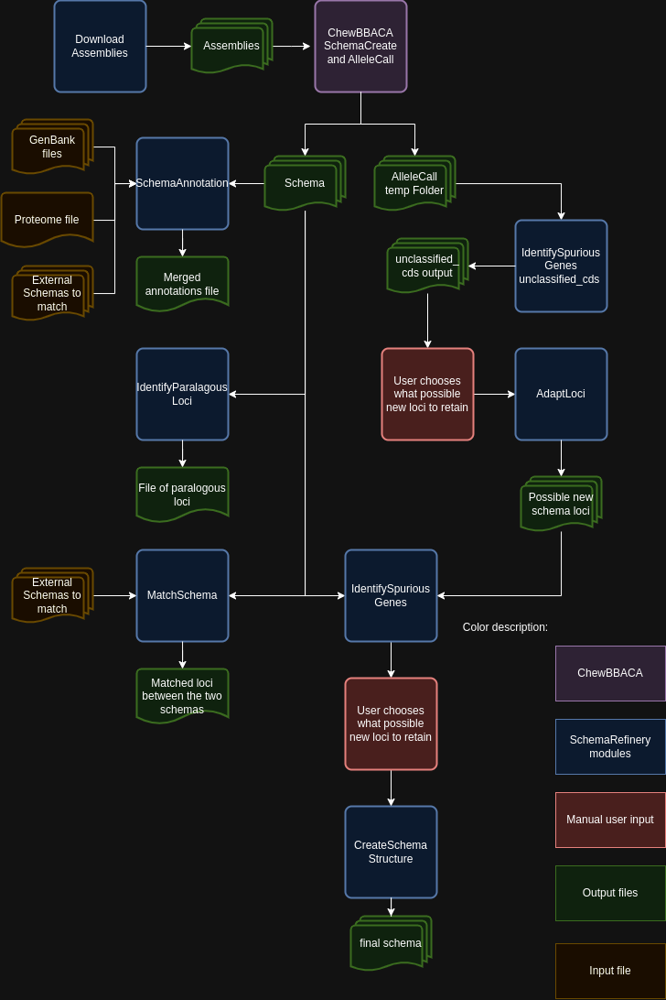

SchemaRefinery - A Tool for Refining Genomic Schemas
====================================================

Description
-----------

The `SchemaRefinery` repository contains tools and modules for refining genomic schemas. These tools help in identifying paralogous loci, spurious genes, and annotating schemas. The repository supports various genomic data processing tasks and provides configurable parameters for different processes.

Dependencies
------------

- Python 3.9 or higher
- Biopython library (`pip install biopython`)
- NCBI datasets (`https://www.ncbi.nlm.nih.gov/datasets/ <https://www.ncbi.nlm.nih.gov/datasets/>`_)

Installation
------------
Current implementation of `SchemaRefinery` is available as a Python package available at `SchemaRefinery GitHub repository <https://github.com/B-UMMI/Schema_Refinery>`_. To install the package, run the following command:

1. **Install Python**: Ensure you have Python 3.9 or higher installed. You can download Python from the official website: https://www.python.org/downloads/

2. **Install Git**: If you don't have Git installed, you can install it using the following command:

    .. code-block:: bash

        sudo apt-get install git # For Debian-based systems
        sudo yum install git # For Red Hat-based systems
        brew install git # For macOS

3. **Clone the Repository**: Clone the `SchemaRefinery` repository from GitHub:

    .. code-block:: bash

        git clone https://github.com/MForofontov/Schema_Refinery.git # Clone the repository

4. **Change Directory**: Navigate to the cloned repository:

    .. code-block:: bash

        cd Schema_Refinery # Change directory to the repository

5. **Install Dependencies**: Install the required Python packages:

    .. code-block:: bash

        pip install biopython

6. **Install the Package**: Install the `SchemaRefinery` package:
    
    .. code-block:: bash

        python setup.py install

7. **Verify Installation**: Verify the installation by running the following command:
    
        .. code-block:: bash
    
            SR --help

Modules
-------

The repository includes the following main modules:

1. **:ref:`IdentifyParalogousLoci <identify_paralogous_loci>`**: Identifies paralogous loci in a schema.
2. **:ref:`IdentifySpuriousGenes <identify_spurious_genes>`**: Identifies spurious genes in a schema.
3. **:ref:`SchemaAnnotation <schema_annotation>`**: Annotates schemas with additional information.
4. **:ref:`MatchSchemas <match_schemas>`**: Matches schemas in a directory.
5. **:ref:`DownloadAssemblies <download_assemblies>`**: Downloads genomic assemblies from various databases.
6. **:ref:`AdaptLoci <adapt_loci>`**: Adapts loci in fasta format to a schema format.

Modules Usage
-------------

Each module can be used independently by running the corresponding script with the required command-line arguments. Below are examples for each module:

### :ref:`IdentifyParalogousLoci <identify_paralogous_loci>`

.. code-block:: bash

    SR IdentifyParalogousLoci --help

### :ref:`IdentifySpuriousGenes <identify_spurious_genes>`

.. code-block:: bash

    SR IdentifySpuriousGenes --help

### :ref:`SchemaAnnotation <schema_annotation>`

.. code-block:: bash

    SR SchemaAnnotation --help

### :ref:`MatchSchemas <match_schemas>`

.. code-block:: bash

    SR MatchSchemas --help

### :ref:`DownloadAssemblies <download_assemblies>`

.. code-block:: bash

    SR DownloadAssemblies --help

### :ref:`AdaptLoci <adapt_loci>`

.. code-block:: bash

    SR AdaptLoci --help

Schema Creation Workflow
------------------------

Algorithm to identify new loci based on the CDS that are not in the schema:

Troubleshooting
---------------

If you encounter issues while using the modules, consider the following troubleshooting steps:

- Verify that the paths to the schema, output, and other directories are correct.
- Check the output directory for any error logs or messages.
- Increase the number of CPUs using the `-c` or `--cpu` option if the process is slow.
- Ensure that you have a stable internet connection.

if the issue persists, please report it to the development team using github issues.

Contributing
------------

We welcome contributions to the SchemaRefinery project. If you would like to contribute, please follow these steps:

1. Fork the repository on GitHub.
2. Create a new branch for your feature or bugfix.
3. Make your changes and commit them with a clear message.
4. Push your changes to your forked repository.
5. Create a pull request to the main repository.

License
-------

This project is licensed under the MIT License. See the `LICENSE <https://opensource.org/license/mit>`_ file for details.

Contact Information
-------------------

For support or to report issues, please contact the development team at github issues in `SchemaRefinery GitHub repository <https://github.com/B-UMMI/Schema_Refinery>`_.